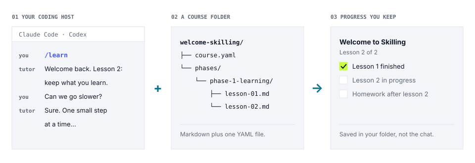

<p align="center">
  <picture>
    <source media="(prefers-color-scheme: dark)" srcset="brand/assets/github/readme-banner-dark.png">
    <source media="(prefers-color-scheme: light)" srcset="brand/assets/github/readme-banner-light.png">
    
  </picture>
</p>

<p align="center">
  <b>Turn the coding assistant you already use into a patient, one-to-one tutor.</b><br>
  Courses are plain folders. Your progress is saved in your own workspace, not in a chat log.
</p>

<p align="center">
  <a href="spec/README.md"></a>
  <a href="https://pypi.org/project/skilling/"></a>
  <a href="docs/implementations.md"></a>
  <a href="docs/implementations.md"></a>
  <a href="LICENSE"></a>
  <a href="spec/LICENSE"></a>
</p>

<p align="center">
  <a href="#start-learning"><b>Start learning</b></a> ·
  <a href="#find-a-course">Find a course</a> ·
  <a href="#write-a-course">Write a course</a> ·
  <a href="spec/README.md">Specification</a>
</p>

<br>

# Turn your coding assistant into a tutor

Good tutoring is a conversation. The tutor explains one idea, asks you a question, listens to
your answer, and goes back over whatever didn't land. Skilling brings that to
**Claude Code or Codex**. You open a learning folder, type `/learn` or `$learn`, and your
assistant teaches you a course one lesson at a time.

<p align="center">
  <picture>
    <source media="(prefers-color-scheme: dark)" srcset="docs/assets/readme/how-it-works-dark.svg">
    <source media="(prefers-color-scheme: light)" srcset="docs/assets/readme/how-it-works-light.svg">
    
  </picture>
</p>

The course, your progress and anything you make all live in that one folder. Close the
assistant halfway through a lesson, come back next week, and the tutor picks up where you
stopped. It doesn't need to remember an old conversation, because the record is on disk.

## Start learning

You need [Git](https://git-scm.com/downloads),
[uv](https://docs.astral.sh/uv/getting-started/installation/), and Claude Code or Codex.
Paste this prompt into your coding host. It sets everything up and starts your first lesson:

> Check that Git and uv are available. If either is missing, stop and show me the matching
> official installation instructions linked from the Skilling README. Install Skilling
> persistently with `uv tool install skilling`, then run `skilling --version` in the
> same environment. Run
> `skilling start 'gh:futureofdev/skilling@v0.7.0#examples/welcome-skilling' my-learning --json`.
> Use the returned workspace path, read its generated host instructions and installed learn
> skill and references, run learner commands from that workspace, and start teaching me. Wait
> for my real replies at every gate. If this host must be reopened to discover the installed
> skills, tell me the exact workspace to open and to invoke `/learn` in Claude Code or `$learn`
> in Codex.

Your first course is *Welcome to Skilling*: two five-minute lessons on how to get the most out
of being tutored.

<details>
<summary><b>Prefer to type the commands yourself?</b></summary>

```bash
uv tool install skilling
skilling --version
skilling start 'gh:futureofdev/skilling@v0.7.0#examples/welcome-skilling' my-learning --json
```

Open the `my-learning` folder it creates in Claude Code or Codex, then type `/learn`
(Claude Code) or `$learn` (Codex). If your host was already open, reopen that folder so it
picks up the new skills.

> [!NOTE]
> The pinned example command works once the `v0.7.0` tag is published. Before then, maintainers
> test the same flow with the retained candidate wheel and an exact commit ref; that
> substitution is not the public learner route.

</details>

Skilling has no language model of its own. Your coding host supplies the model and needs its
usual account and network access.

### What a lesson feels like

```text
you    /learn
tutor  Welcome back. You finished lesson 1 yesterday, so today is lesson 2:
       keeping what you learn. Your progress is already saved. What's one
       goal you'd like to keep from this course, in your own words?
you    I want to stop rushing to the answer and ask more questions
tutor  Good one. Let's write that down in your showcase folder so it's
       there next time...
```

The tutor waits for your real answers, and you can ask for a slower pace or a different
example at any point. Along the way you'll meet:

- **Quizzes.** Three questions at the end of a lesson. A wrong answer never blocks you. Miss
  two and the tutor offers to go over the idea again.
- **Homework.** The tutor reviews what you made and asks before it submits anything.
- **Progress.** Ask "how am I doing?", or type `/progress` (`$progress` in Codex), to see
  what you've finished and your streak, read straight from the saved record.

### What stays yours

- **The course.** A checked copy of the course is saved in your workspace.
- **Your record.** Progress, homework and evidence live under `.skilling/` in the workspace.
- **Your work.** Notes, code and anything else you make go in `showcase/`. Keep it, share it
  or commit it.
- **Your choice of tutor.** The same workspace works in Claude Code and in Codex. Switch
  between them, or move the whole folder, hidden files included, to another machine with
  Skilling installed.

Once a course is set up, the CLI, the course and your progress all work locally. A
cloud-hosted model still needs its normal network access.

### Find a course

| Course | What you'll learn |
|---|---|
| [Welcome to Skilling](examples/welcome-skilling/) | How to learn well with an AI tutor. Start here. |
| [Hello, Skilling](examples/hello-skilling/) | How a Skilling course is put together, taught by a tutor |
| [Workbench](examples/workbench/) | Hands-on files, folders and Git in the shell |

Courses can come from a GitHub repository pinned to a tag or commit, any Git repository, or a
folder on your machine. Private repositories use the Git or `gh` login you already have. See
[course sources](docs/course-sources.md) for the details, and
[learning with Skilling](docs/learning-a-course.md) for resuming, homework, updates and moving
a workspace. If something goes wrong, try [troubleshooting](docs/troubleshooting.md).

<br>

# Write courses people can take with any tutor

A Skilling course is a folder of markdown files plus a small `course.yaml`. There's no
platform to sign up to. Anyone with Claude Code or Codex can take your course, and so can any
other tutor that follows the format.

```text
my-course/
├── course.yaml                       # title, phases, lessons, tutor persona
└── phases/
    └── phase-1-basics/
        ├── overview.md
        ├── lesson-01-first-steps.md      # concept, key terms, exercise, quiz
        └── lesson-02-going-further.md
```

## Write a course

Install the same CLI, scaffold a course, and check it:

```bash
skilling init my-course
skilling validate ./my-course --strict
```

The validator says what's wrong and links to the rule behind it. Every finding has a
stable [error code](docs/error-codes.md), so `validate --strict` is safe to keep in CI.

Then take your own course the way a learner would:

```bash
skilling start ./my-course my-course-preview --json
```

Open the preview in Claude Code or Codex, type `/learn` or `$learn`, and answer for real.
Being taught your course shows you things that rereading it won't.

When it's ready, commit it to Git, tag a release, test the start command in a clean folder,
and share it:

```bash
skilling start 'gh:you/your-repo@v1.0.0#courses/my-course' my-learning --json
```

A few habits make a course teach well:

- **One idea per lesson.** Explain it with a concrete example before you test it.
- **Exercises for a tutor, not a text editor.** Ask the learner to decide, predict or explain,
  and let the tutor do the typing.
- **Objectives you can check.** *Knowledge* objectives cover what a learner can explain.
  *Practice* objectives cover something they visibly do.

The [authoring walkthrough](docs/authoring-a-course.md) goes from an empty folder to a
published course. [Hello, Skilling](examples/hello-skilling/) is a small course to copy from,
and [Workbench](examples/workbench/) exercises the whole format in one compact course.

Once your course is out, you can add this badge to its README:

```markdown
[](https://github.com/futureofdev/skilling)
```

<br>

## Reference implementation and specification

Skilling is an open format. This repository holds its specification and a reference
implementation. The `skilling` package is **LLM-free**: typed models, a loader, a validator, a
pure delivery state machine, a progress store and the learner CLI. It has no agent framework,
model or API key, so it runs in CI or a reporting job.

Specification **1.4.0-draft** is the normative text. Start with the
[specification index](spec/README.md), then the [course format](spec/course-format.md),
[runtime](spec/runtime.md), [workspace](spec/workspace.md) or the
[implementation guide](docs/implementing-a-runtime.md).

So far every known implementation comes from one team, which is why the badge above says
*independent implementations: 0*. [The registry](docs/implementations.md) lists each one and
the limits of what it claims. If you build another, we'd like to hear about it.

## Contributing and licence

Questions, course ideas and reports of unclear spec wording are all welcome. Start with
[CONTRIBUTING.md](CONTRIBUTING.md). Specification text under `spec/` is
[CC BY 4.0](spec/LICENSE). The reference implementation and other repository content are
[Apache-2.0](LICENSE).

<p align="center"><sub>Skilling was created by Future of Dev.</sub></p>
