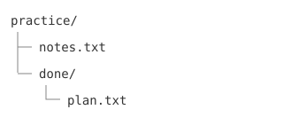

## The Concept

Open a terminal and you are talking to the **shell**: a program that reads a typed command,
runs it, and prints what happened. That is the whole trick. No menus, no icons — a short
conversation, repeated.

Why bother, when clicking works? Because a typed command is **repeatable**. Click through
"new folder, rename, drag the file in" and the work evaporates the moment your hand leaves
the mouse. Type it, and the same line works again tomorrow, works on a hundred files as
easily as one, and can be shown to someone else exactly as you ran it.

Five commands do most of the everyday work:

| Command | What it does |
|---|---|
| `mkdir notes` | Makes a directory called `notes` |
| `touch plan.txt` | Creates an empty file (or updates its timestamp) |
| `mv plan.txt done/` | Moves a file into a directory |
| `mv plan.txt idea.txt` | The same command, given a new name instead: a rename |
| `rm idea.txt` | Removes a file — immediately, with no recycle bin |

Two habits make all of them safer. First, `ls` constantly — list what is actually there
before and after you act, rather than trusting your memory of it. Second, treat `rm` with
respect: it does not ask, and it does not undo.

By the end of the exercise your practice directory will look like this:

## Key Terms

- **Terminal**: The window you type commands into
- **Shell**: The program inside the terminal that reads and runs your commands
- **Prompt**: The `$`, `%`, or `>` symbol showing the shell is ready for the next command
- **Working directory**: The directory your commands act in — `pwd` prints it

## Hands-On Exercise

Build a small tree, then reshape it. Every step uses only commands from this lesson.

1. `mkdir practice` and then `cd practice` — make a workspace and step into it.
2. `touch notes.txt ideas.txt` — create two empty files in one command.
3. `mkdir done` — add a subdirectory.
4. `mv ideas.txt done/plan.txt` — move *and* rename in a single step.
5. `cp notes.txt backup.txt` — copy a file (`cp` is `mv`'s keep-the-original sibling).
6. `rm backup.txt` — remove the copy again.
7. `ls -la` and `ls done/` — confirm the tree matches what you expect: `notes.txt` here,
   `plan.txt` inside `done/`, the backup gone.

If anything surprises you, read the message the shell printed — it usually says exactly
what it objected to.

## Quick Quiz

1. What is the shell?
   - a) A window manager for the desktop
   - b) A program that reads typed commands and runs them
   - c) A programming language for websites
   - d) A file format for scripts

   **Answer:** b) A program that reads typed commands and runs them — the terminal is just
   the window; the shell inside it is what interprets what you type and talks to the
   operating system.

2. Which command creates a new, empty directory?
   - a) `touch`
   - b) `mv`
   - c) `mkdir`
   - d) `rm`

   **Answer:** c) `mkdir` — it makes directories. `touch` creates empty files, `mv` moves
   or renames, and `rm` removes.

3. Besides moving a file into another directory, what else does `mv` do?
   - a) Renames a file
   - b) Copies a file, keeping the original
   - c) Deletes a file
   - d) Prints a file's contents

   **Answer:** a) Renames a file — moving a file to a new name in the same place is a
   rename, and the old name simply stops existing. Keeping the original is `cp`'s job.

## Next Up

Making files is half the job. Next you'll learn to find and read them — by name and by
what's written inside — without opening anything.
