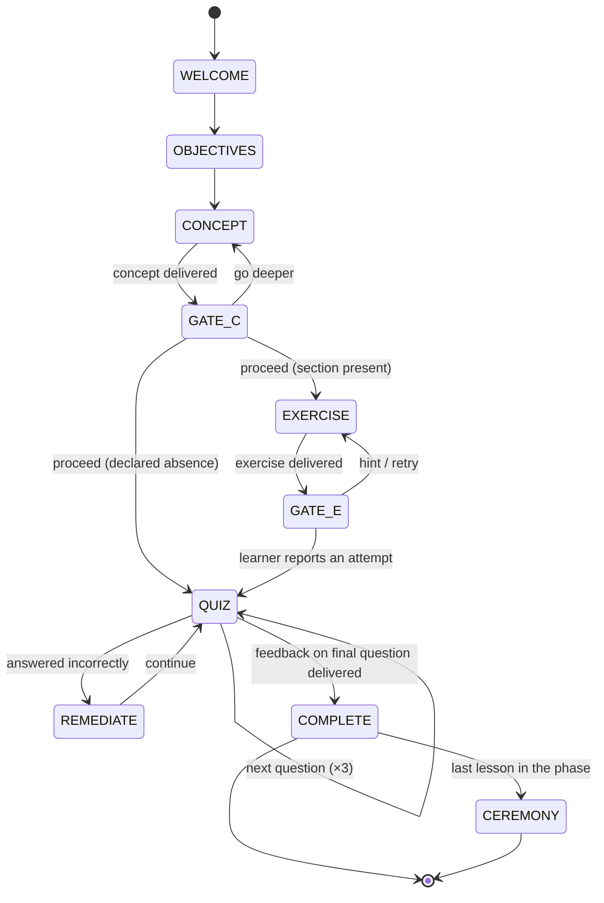
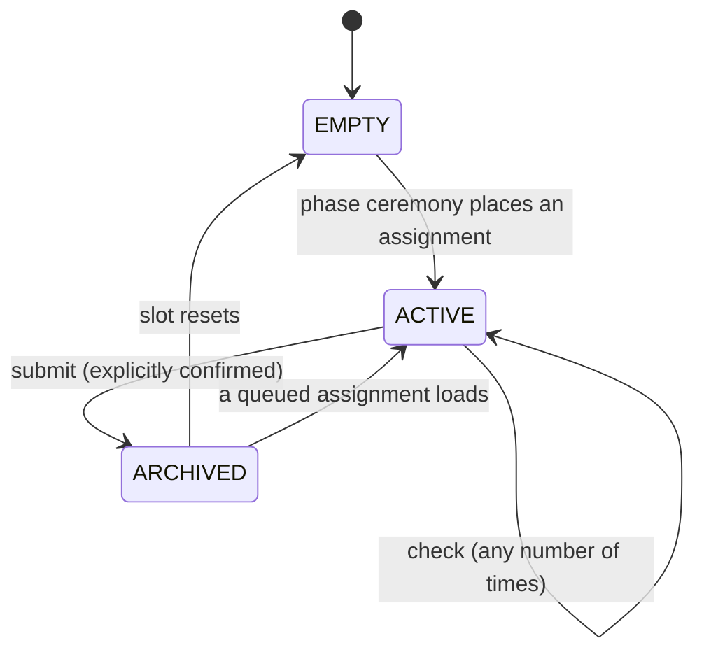

# Runtime

> What a tutor must do to deliver a Skilling course, and what must be durably true afterwards. Read [course format](course-format.md) first.

A runtime is whatever walks a learner through a course: a language-model tutor, a chat bot, a CLI. It delivers the lesson's beats in order, holds the gates, and writes the learner's record through a store.

## Scope of conformance

**This page binds observable state transitions, their ordering, and what gets written — never the tutor's prose.**

Which beat is active, what input unlocked it, what landed in the record: all testable, all required. The wording, warmth, and pedagogy of what the tutor says: entirely yours. You cannot require a language model to teach well; you can require the machinery around it to be correct.

This is why a plain text walker with no model at all can be a Conforming Runtime — and why that is a useful thing to have. It proves the requirements below are mechanical.

## The delivery loop



A runtime delivers the beats in the order of the [section registry](course-format.md#the-section-registry): welcome, objectives, concept, gate, exercise, gate, quiz, completion. Beats are not skipped except where this page says so.

| Beat | Source | What happens |
|---|---|---|
| `welcome` | — | Greet the learner, name the phase and lesson |
| `objectives` | `## Learning Objectives` | Present what they'll be able to do |
| `concept` | `## The Concept`, `## Key Terms` | Teach it |
| `exercise` | `## Hands-On Exercise` | Set the task |
| `quiz` | `## Quick Quiz` | Three questions, one at a time |
| `complete` | `## Next Up` | Record the completion, tease what's next |
| `ceremony` | — | Phase boundary: badges, homework, celebration |

## Gates

A gate is an **open wait**. A runtime must not advance past a gate without an explicit input from the learner, and must not impose a timeout. A learner who closes the laptop and comes back in a fortnight finds the gate exactly where they left it.

**The concept gate** offers both continuations: go deeper, or proceed. Going deeper stays in the concept beat and does not advance position — a learner can ask three follow-up questions and still be exactly where they were.

**The exercise gate** waits for the learner to report an attempt. Asking for a hint stays in the exercise beat. Silence is not completion; neither is enthusiasm.

When the exercise section is a [declared absence](course-format.md#declared-absence), the runtime skips the exercise beat and its gate, and surfaces the author's stated intent in its place.

Gates are the whole reason a tutored course is not a video. Removing one — advancing on a timer, treating a passing check as consent, inferring "shall we move on?" from a long pause — turns tutoring back into playback.

## Quiz delivery

Questions are delivered **one at a time**. Before the learner has answered the current question, a runtime must not reveal a later question, any option's correctness, or any explanation.

After each answer, the runtime gives feedback that states whether the answer was correct **and why**, before presenting the next question. The reason comes from the lesson's answer line.

## Remediation

When a learner answers incorrectly, the runtime must offer a re-explanation of the underlying concept — at minimum, re-presenting `## The Concept`.

After two or more incorrect answers in one quiz, the runtime should offer to revisit the concept beat before completing the lesson. It remains the learner's choice; a wrong answer never blocks completion in informal delivery.

A quiz with no failure path is a quiz that teaches nothing. The originating course had none: a learner could answer all three questions wrongly and be congratulated.

## Completion

A lesson is complete only once feedback for the **final** quiz question has been delivered.

On completion the runtime must, through the store:

1. Add the lesson's coordinate to `completed`
2. Advance `position` to the next lesson
3. Union the lesson's `skills_unlocked` into the record's `skills_unlocked`
4. Update `last_activity` and apply the [streak algorithm](#the-streak-algorithm)
5. Append an entry to the completion log

These writes happen before, or atomically with, announcing completion to the learner. They are atomic, or applied in an order that never shows a completion in the record without its log entry.

**Completion is idempotent.** Re-delivering a lesson the learner has already completed must not change `completed`, the log, the streak, or the badge set. A learner may revisit any lesson freely; revisiting is not completing.

Badges are not optional bookkeeping. A `skills_unlocked` entry that never reaches the record is a conformance failure — the originating system declared badges on eleven lessons and wrote none of them, ever.

## Phase-boundary ceremony

When the completed lesson is the last in its phase — derived from the manifest, never authored — the runtime must:

1. Award any badges registered for the phase's lessons that are not yet in the record
2. When the lesson declares homework, place the assignment in the [homework slot](#the-homework-mailbox)
3. Celebrate. What the celebration says is yours.

Note that the phase's completion is not written anywhere: it is derived from the phase's lessons and the record's `completed` set, like every other count in this format. A stored `phases_completed` field would be a second source of truth, and second sources of truth drift.

A runtime must not invent branded copy — course names, product claims, share text. Celebration language comes from the course or the adopter.

### Resolving ceremony copy

**Since 1.1.** When a course carries a [`ceremony` block](course-format.md#ceremony), resolve in this order:

1. **A literal template**, if the course provides one for this event. Substitute the placeholders and use it verbatim. Do not improve it.
2. **Otherwise, compose from `brand`** — the product, url, mention, handles and hashtags the course declared, plus the phase's `highlight`. This is the path a model-backed tutor should normally take: write something fresh for this learner, using only those facts.
3. **Otherwise, plain unbranded prose.** Congratulate them and stop.

At step 2 the constraint is absolute: **a runtime must not state a fact that is not in `brand`.** Not a URL it thinks is right, not a handle it inferred from the product name, not a claim about what the course costs. Compose freely with the facts you were given and invent none.

Hashtags arrive without their `#`; add it. That is the runtime's job precisely so an author cannot ship `##WebDev`.

## Resume

A runtime resumes a learner at the position in their record: at minimum the recorded lesson's first beat, and when beat-level position is recorded, at that beat. A gate that was open when the session ended resumes as the same open gate.

## Teasers

After completion — and after ceremony, when there was one — the runtime should present the next lesson's teaser: `## Next Up` when present, otherwise one generated from the manifest.

## The progress record

The record is what is durably true about one learner in one course. It is keyed by (`learner_id`, `course_id`). `learner_id` is opaque to this specification: whoever embeds the runtime assigns it, and it is not authentication.

```yaml
learner_id: "a1b2c3"
course_id: hello-skilling
course_version: "1.0.0"
spec_version: "1.1"
position:
  phase: 1
  lesson: 3
  beat: concept          # optional; lesson-level position is the minimum
completed:               # coordinates only; the detail lives in the log
  - "1.1"
  - "1.2"
skills_unlocked: [course-basics]
objectives_met:          # since 1.1; optional
  - id: read-a-manifest
    at: 2026-08-03
    evidence: quiz
started_at: 2026-08-03
last_activity: 2026-08-03
timezone: Europe/London  # IANA name; defaults to UTC
streak_days: 3
telemetry:               # since 1.1
  opt_in: null           # null = never asked; true; false
  anonymous_id: ""       # sink-assigned; write-once
```

| Field group | Requirements |
|---|---|
| `position` | Must always name a lesson that exists in the manifest. Beat-level position is optional; when recorded it must be a beat of the [delivery loop](#the-delivery-loop) and must stay consistent with it — a gate that was open is recorded as that gate. |
| `completed` | A set of coordinates. Order is not significant. |
| Derived values | Completed counts, remaining counts, percentages, and phase boundaries must be **derived** from the manifest plus `completed`, never stored as authoritative fields. Cache them only if the cache is disposable and recomputable. |

**No conversation transcript is ever required.** The record and log must be fully reconstructible without any message history. Transcripts are a runtime's convenience; they are not part of the learner's record, and nothing on this page may depend on one. This is what lets a learner change tutor, model, or product and keep their history.

## Objectives and the record

**Since 1.1.** When a lesson carries [structured objectives](course-format.md#structured-objectives), a runtime may record which of them the learner demonstrated:

```yaml
objectives_met:
  - id: read-a-manifest
    at: 2026-08-03
    evidence: quiz         # quiz | exercise | homework | tutor
```

`evidence` is a closed set naming *how* the objective was demonstrated. `tutor` means a runtime with judgement decided it; the other three name the beat that showed it.

**Writing this is optional.** A runtime that cannot judge whether an objective was met writes nothing — the same position as homework checking, and it conforms. What a runtime must not do is guess: an objective recorded as met without evidence is worse than one left absent, because a later tutor will believe it.

`tested_by` is the bridge for a runtime with no model in it. When every question testing an objective is answered correctly, that objective was demonstrated by the quiz, and it may be recorded with `evidence: quiz`. When any of them was answered wrongly, it was not.

### Objective-targeted remediation

When a learner answers a question wrongly and that question is `tested_by` an objective, remediation should **name that objective** — "this one is about opening a terminal; let me go over that part again" — rather than re-presenting the whole concept. That specificity is the entire reason objectives are addressable, and it is the difference between a tutor who noticed what went wrong and one who simply repeated itself.

### A badge is not an objective

`skills_unlocked` records that a lesson **completed**. `objectives_met` claims a capability was **demonstrated**. They are different claims about different things, and a runtime must not infer either from the other.

This distinction is worth stating plainly because the field name invites the mistake. A badge called `git-basics` awarded on lesson completion means "was present for the git lesson", and if it is going to mean more than that, the objectives behind it are where the evidence lives.

## The completion log

Append-only: one entry per completion event, never rewritten, never reordered.

```yaml
- coordinate: "1.2"
  title: "Anatomy of a Lesson"
  completed_at: 2026-08-03T14:31:07Z
  course_version: "1.0.0"
```

The record's `completed` set must be reconstructible from the log alone. Where the two disagree, the log is the truth.

## The streak algorithm

On each completion, with dates evaluated in the record's `timezone`:

| `last_activity` was | `streak_days` becomes |
|---|---|
| Yesterday | Incremented by 1 |
| Today | Unchanged |
| Older than yesterday, or unset | Reset to 1 |

`last_activity` is then set to today.

## The homework mailbox

Each (learner, course) pair has exactly **one** homework slot. At most one assignment is active at a time.



The slot is filled only by [phase ceremony](#phase-boundary-ceremony): the runtime copies the completing lesson's `## Homework Assignment` into the slot, stamped with its source coordinate and unlock time. If the slot is already active, the runtime must not overwrite it — the new assignment queues behind the active one and loads when the slot resets.

```yaml
# homework/active.yaml — an absent file means the slot is empty
coordinate: "1.3"
title: "Write Your Own Course"
objective: "Author a conforming two-lesson course and validate it."
requirements:
  - text: "A course.yaml with one phase and two lessons"
    verdict: null            # met | partial | not-yet | null (unchecked)
    reason: ""
stretch_goals:
  - text: "Declare an absent Key Terms section with intent"
    verdict: null
    reason: ""
submission: "Share the directory with your tutor."
unlocked_at: 2026-08-03T14:31:07Z
queued: []
```

### Check

A check evaluates the learner's work against the assignment's requirements and returns a per-requirement verdict — **met**, **partial**, or **not-yet** — each with a reason. Stretch goals are reported separately and never gate anything.

**A check must not change the slot state**, mark the assignment complete, or write to the completion log — no matter how finished the work looks. Checks are repeatable without limit. Separating feedback from completion is the point: a learner must be able to ask "how am I doing?" a dozen times without accidentally finishing.

Offering checks is optional. A runtime with no way to judge work — a text walker, for instance — displays the assignment and accepts a submission, and is conforming. A runtime that *does* offer checks must return per-requirement verdicts rather than a single overall grade.

### Submit

Submission requires an explicit learner confirmation **as its own input**, distinct from the input that requested submission. A runtime must not infer confirmation from a passing check, from enthusiasm, or from silence.

On confirmed submission the runtime must, atomically or in this order and never partially:

1. Archive the assignment with its final verdicts and a timestamp
2. Reset the slot to empty, or load the queued assignment

Archives are append-only and immutable. Submission is idempotent per assignment instance: retrying a submit of an already-archived instance is a no-op that returns the archived result.

When asked for homework with an empty slot, a runtime should explain how assignments unlock — finish the phase — rather than inventing one.

The mailbox is deliberately small. Multiple concurrent assignments, deadlines, and grading workflows are the adopter's business: build them *on* the archive, not *into* the slot.

## Hooks

**Since 1.1.** Hooks are where mechanism ends and policy begins. Skilling keeps the record; everything an organisation does *around* the record attaches here, by name, instead of leaking into the runtime.

**A runtime must not implement enrolment, cohorts, catalogues, manager dashboards, or directory integration.** It must expose the registry below so an adopter can build those outside it.

That is the most opinionated rule in this specification, and it is the one that keeps an open tutoring format from quietly becoming a proprietary LMS. A runtime delivers one course to one learner. Everything else is somebody else's job.

### The registry

A runtime emits these to every registered sink, at the moments the loop defines:

| Event | Fired when | Payload beyond the envelope |
|---|---|---|
| `lesson_started` | The welcome beat is delivered | `coordinate` |
| `gate_opened` | A gate begins waiting | `coordinate`, `beat` |
| `quiz_answered` | Each answer is given | `coordinate`, `question`, `correct` |
| `lesson_completed` | Completion is written | `coordinate`, `title` |
| `badge_awarded` | A badge enters the record | `badge_id` |
| `phase_completed` | Ceremony runs | `phase`, `badges_awarded` |
| `course_completed` | The final lesson completes | — |
| `homework_submitted` | A submission is archived | `coordinate`, `verdicts` |

Every event carries the same envelope: `event`, `occurred_at`, `course_id`, `course_version`, `spec_version`, and `learner`.

### Delivery is fire-and-forget

Emitting must not block or delay the delivery loop. A failing, slow, or unreachable sink must not surface an error to the learner and must not prevent a record write. A sink that needs reliability puts a queue behind itself; that is its problem, not the loop's.

This has to be true of *slow* sinks and not only broken ones. A sink that takes five seconds to answer has stopped the lesson just as effectively as one that raises.

## Telemetry

**Since 1.1.** A telemetry sink is any hook consumer that leaves the adopter's trust boundary — a product-analytics endpoint, a course author's usage counter. Three rules are non-negotiable.

**Opt-in, per learner, ternary.** `telemetry.opt_in` is `null` (never asked), `true`, or `false`. `null` means ask once, before the first emission. `false` means nothing is emitted, ever. Asking must be honest: no dark-pattern default, no pre-ticked box, no burying it.

**Identity is the anonymous id.** The learner's identity in a telemetry event is the sink-assigned, write-once `anonymous_id` — never the producer's `learner_id`. The sink assigns it on the first opted-in event and it is never overwritten.

**Payloads are content-free.** Event names, coordinates, question numbers, booleans, timestamps. Never conversation text, never a learner's written answer, never homework content.

Consent belongs to the runtime's dispatch, not to a sink. A sink that forgot to check `opt_in` must not be *able* to leak — which means the check happens before a sink is ever handed an event.

> **Content-free is not behaviour-free.** An opted-in learner's `gate_opened` timings and `quiz_answered` booleans let a sink reconstruct where they hesitated and what they got wrong. That is the honest description of what opting in means here, and a producer presenting the choice should not pretend otherwise.

## The store interface

A store persists records, completion logs, and homework behind one small interface, so the same runtime serves one learner writing files on a laptop and ten thousand on a database. `revision` is an opaque token the store issues with every read.

| Operation | Semantics |
|---|---|
| `get_record(learner_id, course_id)` → `(record, revision)` or `None` | The current record, if any |
| `put_record(record, expected_revision)` → `revision` | Write; see concurrency below |
| `append_completion(learner_id, course_id, entry)` | Append-only log write |
| `get_log(learner_id, course_id)` → `[entry]` | The full log, in append order |
| `get_homework(learner_id, course_id)` → `(slot, revision)` | Mailbox state |
| `put_homework(slot, expected_revision)` → `revision` | Mailbox write |
| `append_homework_archive(learner_id, course_id, entry)` | Append-only archive |
| `get_homework_archive(learner_id, course_id)` → `[entry]` | The archive, oldest first |
| `list_records(course_id)` → `[(learner_id, record)]` | Enumeration for reporting; optional for single-learner backends |

- **Optimistic concurrency.** A `put_*` whose `expected_revision` is not the store's current revision must fail with a distinguishable conflict error and must not write. Silent last-write-wins is not conforming.
- **Append-only means append-only.** Log and archive entries are never mutated, deleted, or reordered by any operation.
- **Durability before acknowledgement.** An acknowledged completion survives a crash of the runtime, the store, or both.
- **Atomicity.** A completion's record update and log append are atomic, or applied log-first, so no observable state shows a completion without its log entry.
- **Storage is dumb on purpose.** A store must not interpret, enrich, or repair record contents. Derivation is the runtime's job.
- **No transcripts.** No operation may require conversation history.

A multi-learner store must key all state by (`learner_id`, `course_id`), must isolate learners — no operation returns another learner's state except `list_records` — and must implement atomicity transactionally. It must make deletion of a (`learner_id`, `course_id`) pair *possible*; when that happens is the adopter's policy, not this specification's.

## The file layout

The single-learner local layout is specified so that any runtime can read any learner's local state. This is what makes local progress portable between tools.

```
<state-root>/<course_id>/
├── record.yaml              # the progress record
├── completed.yaml           # the completion log, append-only
└── homework/
    ├── active.yaml          # the slot; an absent file means empty
    └── archive/
        └── {coordinate}-{date}.yaml
```

A file backend must use this layout, must implement optimistic concurrency with an atomic rename or equivalent plus revision tokens (a content hash or a monotonic counter stored in the file), and serves exactly one learner per `<state-root>` — `learner_id` is implicit. `list_records` is optional for file backends and required for multi-learner ones.

## What conformance cannot promise

Conformance binds machinery: transitions, records, formats, separations. It cannot certify that a tutor's prose is good teaching, that a course's content is correct, or that a learner did their own homework. Claims beyond the machinery are marketing.
