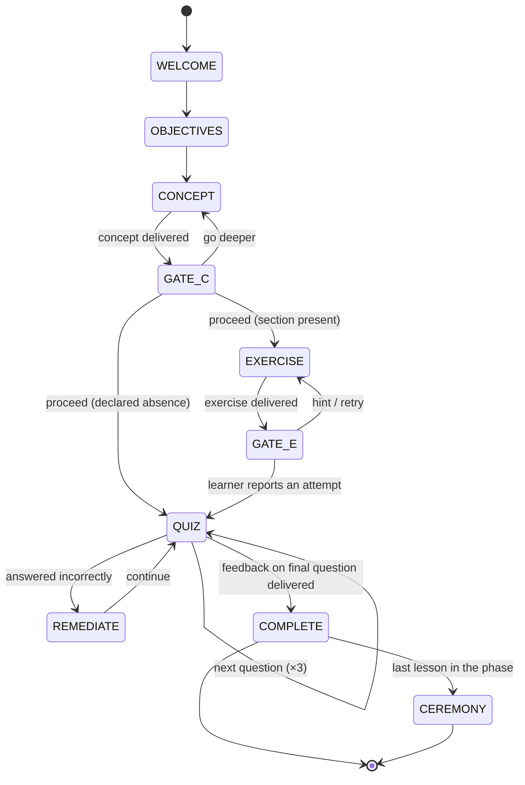
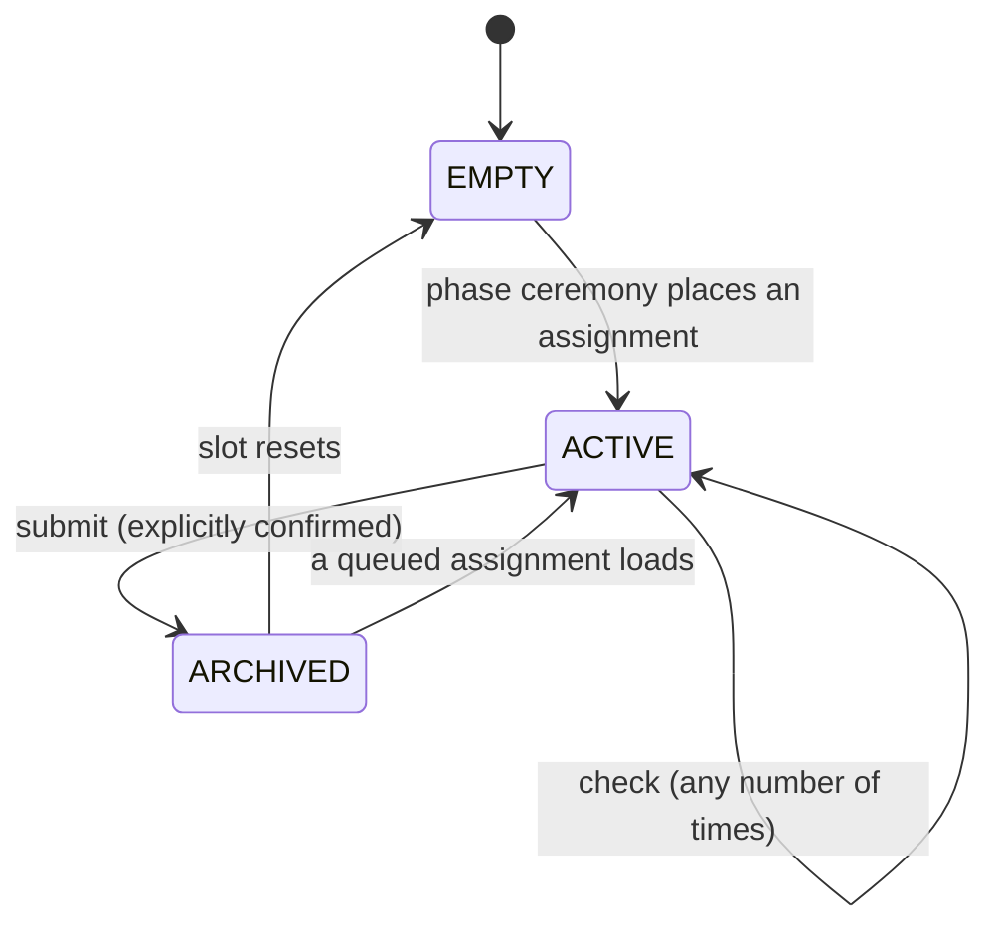

# Runtime

> What a tutor must do to deliver a Skilling course, and what must be durably true afterwards. Read [course format](course-format.md) first.

A runtime is whatever walks a learner through a course: a language-model tutor, a chat bot, a CLI. It delivers the lesson's beats in order, holds the gates, and writes the learner's record through a store.

## Scope of conformance

**This page binds observable state transitions, their ordering, and what gets written — never the tutor's prose.**

Which beat is active, what input unlocked it, what landed in the record: all testable, all required. The wording, warmth, and pedagogy of what the tutor says: entirely yours. You cannot require a language model to teach well; you can require the machinery around it to be correct.

This is why a plain text walker with no model at all can be a Conforming Runtime — and why that is a useful thing to have. It proves the requirements below are mechanical.

## The delivery loop



A runtime delivers the beats in the order of the [section registry](course-format.md#the-section-registry): welcome, objectives, concept, gate, exercise, gate, quiz, completion. Beats are not skipped except where this page says so.

| Beat | Source | What happens |
|---|---|---|
| `welcome` | — | Greet the learner, name the phase and lesson |
| `objectives` | `## Learning Objectives` | Present what they'll be able to do |
| `concept` | `## The Concept`, `## Key Terms` | Teach it |
| `exercise` | `## Hands-On Exercise` | Set the task |
| `quiz` | `## Quick Quiz` | Three questions, one at a time |
| `complete` | `## Next Up` | Record the completion, tease what's next |
| `ceremony` | — | Phase boundary: badges, homework, celebration |

## Gates

A gate is an **open wait**. A runtime must not advance past a gate without an explicit input from the learner, and must not impose a timeout. A learner who closes the laptop and comes back in a fortnight finds the gate exactly where they left it.

**The concept gate** offers both continuations: go deeper, or proceed. Going deeper stays in the concept beat and does not advance position — a learner can ask three follow-up questions and still be exactly where they were.

**The exercise gate** waits for the learner to report an attempt. Asking for a hint stays in the exercise beat. Silence is not completion; neither is enthusiasm.

When the exercise section is a [declared absence](course-format.md#declared-absence), the runtime skips the exercise beat and its gate, and surfaces the author's stated intent in its place.

Gates are the whole reason a tutored course is not a video. Removing one — advancing on a timer, treating a passing check as consent, inferring "shall we move on?" from a long pause — turns tutoring back into playback.

## Quiz delivery

Questions are delivered **one at a time**. Before the learner has answered the current question, a runtime must not reveal a later question, any option's correctness, or any explanation.

After each answer, the runtime gives feedback that states whether the answer was correct **and why**, before presenting the next question. The reason comes from the lesson's answer line.

## Remediation

When a learner answers incorrectly, the runtime must offer a re-explanation of the underlying concept — at minimum, re-presenting `## The Concept`.

After two or more incorrect answers in one quiz, the runtime should offer to revisit the concept beat before completing the lesson. It remains the learner's choice; a wrong answer never blocks completion in informal delivery.

A quiz with no failure path is a quiz that teaches nothing. The originating course had none: a learner could answer all three questions wrongly and be congratulated.

## Completion

A lesson is complete only once feedback for the **final** quiz question has been delivered.

On completion the runtime must, through the store:

1. Add the lesson's coordinate to `completed`
2. Advance `position` to the next lesson
3. Union the lesson's `skills_unlocked` into the record's `skills_unlocked`
4. Update `last_activity` and apply the [streak algorithm](#the-streak-algorithm)
5. Append an entry to the completion log

These writes happen before, or atomically with, announcing completion to the learner. They are atomic, or applied in an order that never shows a completion in the record without its log entry.

**Completion is idempotent.** Re-delivering a lesson the learner has already completed must not change `completed`, the log, the streak, or the badge set. A learner may revisit any lesson freely; revisiting is not completing.

For newly committed completions, the runtime must prepare one durable operation identity and
write set before its first completion effect. Identity binds the learner, course, course
version and lesson coordinate. The write set includes the final record, matching log entry,
phase badges, any required homework placement or queue update, and the runtime's completion
checkpoint reset. The runtime derives these effects and freezes their original timestamps;
the store persists them mechanically through [the completion commit](#completion-commit).
An interrupted operation must recover the same effects before later cooperating reads or
writes proceed. A next-day retry must not manufacture a new completion date, streak update,
assignment unlock time or log entry.

A retry identifies the original operation, not the record's new next-lesson position or the
order of `completed`. Its response uses the current durable record and revision. A previous
completion receipt does not authorize completing a subsequent lesson before that lesson's
final quiz feedback has been delivered. Historical files without trustworthy completion
intent must remain readable; their presence does not authorize guessed repairs, removal of
old duplicate log entries, or creation of missing historical homework.

Badges are not optional bookkeeping. A `skills_unlocked` entry that never reaches the record is a conformance failure — the originating system declared badges on eleven lessons and wrote none of them, ever.

## Phase-boundary ceremony

When the completed lesson is the last in its phase — derived from the manifest, never authored — the runtime must:

1. Award any badges registered for the phase's lessons that are not yet in the record
2. When the lesson declares homework, place the assignment in the [homework slot](#the-homework-mailbox)
3. Celebrate. What the celebration says is yours.

Note that the phase's completion is not written anywhere: it is derived from the phase's lessons and the record's `completed` set, like every other count in this format. A stored `phases_completed` field would be a second source of truth, and second sources of truth drift.

A runtime must not invent branded copy — course names, product claims, share text. Celebration language comes from the course or the adopter.

### Resolving ceremony copy

**Since 1.1.** When a course carries a [`ceremony` block](course-format.md#ceremony), resolve in this order:

1. **A literal template**, if the course provides one for this event. Substitute the placeholders and use it verbatim. Do not improve it.
2. **Otherwise, compose from `brand`** — the product, url, mention, handles and hashtags the course declared, plus the phase's `highlight`. This is the path a model-backed tutor should normally take: write something fresh for this learner, using only those facts.
3. **Otherwise, plain unbranded prose.** Congratulate them and stop.

At step 2 the constraint is absolute: **a runtime must not state a fact that is not in `brand`.** Not a URL it thinks is right, not a handle it inferred from the product name, not a claim about what the course costs. Compose freely with the facts you were given and invent none.

Hashtags arrive without their `#`; add it. That is the runtime's job precisely so an author cannot ship `##WebDev`.

## Resume

A runtime resumes a learner at the position in their record: at minimum the recorded lesson's first beat, and when beat-level position is recorded, at that beat. A gate that was open when the session ended resumes as the same open gate.

When quiz-level position is recorded, the quiz resumes at the recorded question. Remediation bookkeeping (wrong-answer counts, an offered revisit) is runtime-private and resets on resume; a resumed session may therefore re-offer a revisit already offered, or route forward from the concept gate when a return to the quiz was pending. This is a deliberate residual: the record holds what is durably true, not a tutor's working memory.

## Teasers

After completion — and after ceremony, when there was one — the runtime should present the next lesson's teaser: `## Next Up` when present, otherwise one generated from the manifest.

## The progress record

The record is what is durably true about one learner in one course. It is keyed by (`learner_id`, `course_id`). `learner_id` is opaque to this specification: whoever embeds the runtime assigns it, and it is not authentication.

```yaml
learner_id: "a1b2c3"
course_id: hello-skilling
course_version: "1.0.0"
spec_version: "1.2"
position:
  phase: 1
  lesson: 3
  beat: concept          # optional; lesson-level position is the minimum
completed:               # coordinates only; the detail lives in the log
  - "1.1"
  - "1.2"
skills_unlocked: [course-basics]
objectives_met:          # since 1.1; optional
  - id: read-a-manifest
    at: 2026-08-03
    evidence: explained
artifacts:               # since 1.4; optional, meaningful only within a workspace
  - path: showcase/hello-skilling/first-page/index.html
    title: My first page
    coordinate: "1.3"
    added_at: 2026-08-03T14:31:07Z
started_at: 2026-08-03
last_activity: 2026-08-03
timezone: Europe/London  # IANA name; defaults to UTC
streak_days: 3
telemetry:               # since 1.1
  opt_in: null           # null = never asked; true; false
  anonymous_id: ""       # sink-assigned; write-once
```

| Field group | Requirements |
|---|---|
| `position` | Must always name a lesson that exists in the manifest. Beat-level position is optional; when recorded it must be a beat of the [delivery loop](#the-delivery-loop) and must stay consistent with it — a gate that was open is recorded as that gate. `question_index` (since 1.3) is optional and meaningful only when `beat` is `quiz` or `remediate`: the 0-based quiz question awaiting an answer. Additive, like `beat` itself — a record without it resumes at question 0. |
| `completed` | A set of coordinates. Order is not significant. |
| `artifacts` | Since 1.4; optional, and meaningful only within a [workspace](workspace.md#artifacts). Pointers to work the learner built: a workspace-relative POSIX `path`, a `title`, the `coordinate` it was recorded at, and `added_at`. Written only through the CLI, at phase ceremony and confirmed homework submission; artifacts never gate the delivery loop, and a record without the field loads unchanged. |
| Derived values | Completed counts, remaining counts, percentages, and phase boundaries must be **derived** from the manifest plus `completed`, never stored as authoritative fields. Cache them only if the cache is disposable and recomputable. |

**No conversation transcript is ever required.** The record and log must be fully reconstructible without any message history. Transcripts are a runtime's convenience; they are not part of the learner's record, and nothing on this page may depend on one. This is what lets a learner change tutor, model, or product and keep their history.

## Objectives and the record

**Since 1.1.** When a lesson carries [structured objectives](course-format.md#structured-objectives), a runtime may record which of them the learner demonstrated:

```yaml
objectives_met:
  - id: read-a-manifest
    at: 2026-08-03
    evidence: explained
  - id: install-node
    at: 2026-08-03
    evidence: observed
    provenance:                                   # since 1.3; required when evidence is observed
      checked: "node --version → v22.20.0"
      verify: "Node reports a version"
      attested_by: codex
```

`evidence` is a closed set naming *how* the objective was demonstrated:

| `evidence` | Means |
|---|---|
| `explained` | The learner explained it to a tutor's satisfaction |
| `observed` | A runtime looked at their machine or their work and saw it |
| `homework` | It follows from a homework requirement's verdict |

**`provenance` is since 1.3, and required whenever `evidence` is `observed`.** `checked` names what was actually inspected, `verify` repeats the objective's `verify` sentence verbatim, and `attested_by` names the host making the claim (`"codex"`, `"claude-code"`, and so on). It is recorded **because the attestation cannot be verified** — a store has no way to confirm that a host actually ran the check it claims to have run — so the honest response is not to refuse the claim but to write down exactly who made it and what they said they checked, so a later reader can weigh it. `provenance` is not a substitute for verification; it is what a record can honestly say once verification has already happened somewhere this specification cannot see. `explained` and `homework` entries carry no `provenance` — only an outside claim about the learner's machine or work needs one.

**Writing this is optional.** A runtime that cannot gather the right evidence writes nothing — the same position as homework checking, and it conforms. What a runtime must not do is guess: an objective recorded as met without evidence is worse than one left absent, because a later tutor will believe it and skip teaching something the learner never learned.

**A quiz settles nothing.** Three four-option questions cannot demonstrate a capability — one question is guessed right a quarter of the time, and no multiple-choice question can establish that software is installed or a commit exists. There is no `evidence: quiz`.

## Capabilities and what may be settled

**Since 1.2.** A runtime's [`kind`-handling](course-format.md#what-kind-of-claim-it-is) depends on what it can actually observe, so a conformance claim names its capabilities:

| Capability | The runtime can | So it may settle |
|---|---|---|
| `converse` | hold a conversation and judge an explanation | `knowledge` objectives, with `evidence: explained` |
| `observe` | inspect the learner's filesystem, repository, or command output | `practice` objectives, with `evidence: observed` and a [`provenance`](#objectives-and-the-record) record of what it checked |
| `assess` | judge a submitted work product against requirements | homework verdicts, and objectives that follow from them |

**A runtime must not settle an objective whose kind it lacks the capability for.** A chat tutor with no filesystem access leaves every `practice` objective alone, however confident the learner sounds. A text walker with none of the three settles nothing at all.

Claims read *"Conforming Runtime (converse, assess), Skilling 1.2"*. A runtime with no capabilities is still a Conforming Runtime — it delivers the loop, holds the gates, and writes a correct record. It simply makes no capability claims about the learner, which is the truthful thing for it to do.

### Verifying a practice objective

A runtime with `observe` and a `verify` clause has everything it needs: the clause says what success looks like, and the runtime works out how to look. It records `evidence: observed` when it finds it and leaves the objective alone when it does not — and, since 1.3, it records `provenance` alongside that evidence: what it actually checked, the `verify` sentence it satisfied, and which host is making the claim. The record cannot verify that claim independently, so it writes down who made it instead of either refusing it outright or accepting it silently.

A `check` command, where the course supplies one, is a **proposal**. A runtime may decline it, must put it through its host's permission model, and must never run it silently. `verify` stays the authority on what is being established.

A `practice` objective with no `verify` cannot be observed from outside. Leave it unsettled unless `assess` gives you grounds — "apply the design system consistently" is a judgement, not a check.

### Objective-targeted remediation

When a learner answers a question wrongly and that question is [`about`](course-format.md#remediation-not-evidence) an objective, remediation should **name that objective** — "this one is about opening a terminal; let me go over that part again" — rather than re-presenting the whole concept. That specificity is the entire reason objectives are addressable, and it is the difference between a tutor who noticed what went wrong and one who simply repeated itself.

Note the asymmetry, because it is the point: `about` steers what a tutor *says*, where being slightly wrong costs a slightly-off sentence. Evidence goes into a record that outlives the conversation, where being slightly wrong is a lie. Those needs are different enough to deserve different fields.

### A badge is not an objective

`skills_unlocked` records that a lesson **completed**. `objectives_met` claims a capability was **demonstrated**. They are different claims about different things, and a runtime must not infer either from the other.

This distinction is worth stating plainly because the field name invites the mistake. A badge called `git-basics` awarded on lesson completion means "was present for the git lesson", and if it is going to mean more than that, the objectives behind it are where the evidence lives.

## The completion log

Append-only: one entry per completion event, never rewritten, never reordered.

```yaml
- coordinate: "1.2"
  title: "Anatomy of a Lesson"
  completed_at: 2026-08-03T14:31:07Z
  course_version: "1.0.0"
```

The record's `completed` set must be reconstructible from the log alone. Where the two disagree, the log is the truth.

## The streak algorithm

On each completion, with dates evaluated in the record's `timezone`:

| `last_activity` was | `streak_days` becomes |
|---|---|
| Yesterday | Incremented by 1 |
| Today | Unchanged |
| Older than yesterday, or unset | Reset to 1 |

`last_activity` is then set to today.

## The homework mailbox

Each (learner, course) pair has exactly **one** homework slot. At most one assignment is active at a time.



The slot is filled only by [phase ceremony](#phase-boundary-ceremony): the runtime copies the completing lesson's `## Homework Assignment` into the slot, stamped with its source coordinate and unlock time. If the slot is already active, the runtime must not overwrite it — the new assignment queues behind the active one and loads when the slot resets.

```yaml
# homework/active.yaml — an absent file means the slot is empty
coordinate: "1.3"
title: "Write Your Own Course"
objective: "Author a conforming two-lesson course and validate it."
requirements:
  - text: "A course.yaml with one phase and two lessons"
    verdict: null            # met | partial | not-yet | null (unchecked)
    reason: ""
stretch_goals:
  - text: "Declare an absent Key Terms section with intent"
    verdict: null
    reason: ""
submission: "Share the directory with your tutor."
unlocked_at: 2026-08-03T14:31:07Z
queued: []
```

### Check

A check evaluates the learner's work against the assignment's requirements and returns a per-requirement verdict — **met**, **partial**, or **not-yet** — each with a reason. Stretch goals are reported separately and never gate anything.

**A check must not change the slot state**, mark the assignment complete, or write to the completion log — no matter how finished the work looks. Checks are repeatable without limit. Separating feedback from completion is the point: a learner must be able to ask "how am I doing?" a dozen times without accidentally finishing.

Offering checks is optional. A runtime with no way to judge work — a text walker, for instance — displays the assignment and accepts a submission, and is conforming. A runtime that *does* offer checks must return per-requirement verdicts rather than a single overall grade.

### Submit

Submission requires an explicit learner confirmation **as its own input**, distinct from the input that requested submission. A runtime must not infer confirmation from a passing check, from enthusiasm, or from silence.

The runtime binds the displayed assignment and exact slot revision before asking for that
confirmation. The Python reference CLI's `homework check` returns `submission_token` beside
`active` and `revision`, or null when empty. This versioned opaque token binds learner,
course, course version, immutable assignment instance, and checked revision. The instance
includes coordinate, unlock time and assignment content; it excludes verdicts, reasons and
queued assignments. Revision comparison still detects changes to any of those excluded
fields. Token derivation is read-only and portable. A token is neither a secret nor proof of
consent; hosts must still obtain the distinct real learner reply.

`homework submit --token TOKEN` requires that exact checked token. Missing, malformed and
wrong-stream tokens refuse before opening learner state. The Python runtime's
`submit_homework(store, learner_id, course_id, coordinate, *, token=...)` also requires it;
coordinate is an identity check, never a selector for the current slot or latest archive.
A pre-acceptance slot change conflicts without a new submission effect. The host must check
again and obtain a new confirmation, not silently replace the token.

Before its first effect, a new submission durably prepares the exact archive and slot write
set, then applies this order under one serialization boundary (or an equivalent transaction):

1. Append the original assignment, final verdicts and original timestamp to an immutable archive
2. Reset the slot or promote its queue head exactly once, preserving the remaining queue
3. Persist the accepted token's immutable receipt and acknowledge the committed operation

Accepted-token replay is checked before the active revision: it returns that token's
original archive even on the next day or after the queue has advanced. A repeated coordinate
with a different unlock time or content is a distinct instance and needs its own token and
confirmation. Legacy duplicate archives remain unchanged; recovery never guesses which old
coordinate-only call was intended. See [submission commit](#submission-commit).

When asked for homework with an empty slot, a runtime should explain how assignments unlock — finish the phase — rather than inventing one.

The mailbox is deliberately small. Multiple concurrent assignments, deadlines, and grading workflows are the adopter's business: build them *on* the archive, not *into* the slot.

## Hooks

**Since 1.1.** Hooks are where mechanism ends and policy begins. Skilling keeps the record; everything an organisation does *around* the record attaches here, by name, instead of leaking into the runtime.

**A runtime must not implement enrolment, cohorts, catalogues, manager dashboards, or directory integration.** It must expose the registry below so an adopter can build those outside it.

That is the most opinionated rule in this specification, and it is the one that keeps an open tutoring format from quietly becoming a proprietary LMS. A runtime delivers one course to one learner. Everything else is somebody else's job.

### The registry

A runtime emits these to every registered sink, at the moments the loop defines:

| Event | Fired when | Payload beyond the envelope |
|---|---|---|
| `lesson_started` | The welcome beat is delivered | `coordinate` |
| `gate_opened` | A gate begins waiting | `coordinate`, `beat` |
| `quiz_answered` | Each answer is given | `coordinate`, `question`, `correct` |
| `lesson_completed` | Completion is written | `coordinate`, `title` |
| `badge_awarded` | A badge enters the record | `badge_id` |
| `phase_completed` | Ceremony runs | `phase`, `badges_awarded` |
| `course_completed` | The final lesson completes | — |
| `homework_submitted` | A submission is archived | `coordinate`, `verdicts` |

Every event carries the same envelope: `event`, `occurred_at`, `course_id`, `course_version`, `spec_version`, and `learner`.

### Delivery is fire-and-forget

Emitting must not block or delay the delivery loop. A failing, slow, or unreachable sink must not surface an error to the learner and must not prevent a record write. A sink that needs reliability puts a queue behind itself; that is its problem, not the loop's.

This has to be true of *slow* sinks and not only broken ones. A sink that takes five seconds to answer has stopped the lesson just as effectively as one that raises.

Completion events are emitted only after the entire completion commit is durable, using the
original operation time. An ordinary new commit emits its badge, lesson, phase and course
events as applicable; recovery and already-committed retries emit none. A process that dies
after committing but before dispatch may omit those events. Completion recovery therefore
promises durable learner state, not exactly-once external delivery, and must not block on a
sink to bridge that gap.

The same best-effort rule applies to `homework_submitted`: only a new uninterrupted
submission dispatches after durability, at its original time. Recovery and accepted-token
replay dispatch nothing. A process dying after commit may omit the notification.

## Telemetry

**Since 1.1.** A telemetry sink is any hook consumer that leaves the adopter's trust boundary — a product-analytics endpoint, a course author's usage counter. Three rules are non-negotiable.

**Opt-in, per learner, ternary.** `telemetry.opt_in` is `null` (never asked), `true`, or `false`. `null` means ask once, before the first emission. `false` means nothing is emitted, ever. Asking must be honest: no dark-pattern default, no pre-ticked box, no burying it.

**Identity is the anonymous id.** The learner's identity in a telemetry event is the sink-assigned, write-once `anonymous_id` — never the producer's `learner_id`. The sink assigns it on the first opted-in event and it is never overwritten.

**Payloads are content-free.** Event names, coordinates, question numbers, booleans, timestamps. Never conversation text, never a learner's written answer, never homework content.

Consent belongs to the runtime's dispatch, not to a sink. A sink that forgot to check `opt_in` must not be *able* to leak — which means the check happens before a sink is ever handed an event.

> **Content-free is not behaviour-free.** An opted-in learner's `gate_opened` timings and `quiz_answered` booleans let a sink reconstruct where they hesitated and what they got wrong. That is the honest description of what opting in means here, and a producer presenting the choice should not pretend otherwise.

## The store interface

A store persists records, completion logs, and homework behind one small interface, so the same runtime serves one learner writing files on a laptop and ten thousand on a database. `revision` is an opaque token the store issues with every read.

| Operation | Semantics |
|---|---|
| `get_record(learner_id, course_id)` → `(record, revision)` or `None` | The current record, if any |
| `put_record(record, expected_revision)` → `revision` | Write; see concurrency below |
| `append_completion(learner_id, course_id, entry)` | Append-only log write |
| `get_log(learner_id, course_id)` → `[entry]` | The full log, in append order |
| `get_homework(learner_id, course_id)` → `(slot, revision)` | Mailbox state |
| `put_homework(slot, expected_revision)` → `revision` | Mailbox write |
| `append_homework_archive(learner_id, course_id, entry)` | Append-only archive |
| `get_homework_archive(learner_id, course_id)` → `[entry]` | The archive, oldest first |
| `list_records(course_id)` → `[(learner_id, record)]` | Enumeration for reporting; optional for single-learner backends |
| `get_completion_receipt(learner_id, course_id)` → `CompletionReceipt` or `None` | The latest durable completion receipt, after pending recovery |
| `commit_completion(commit)` → `CompletionCommitResult` | Persist or recover one runtime-prepared completion write set |
| `get_submission_receipt(learner_id, course_id, token)` → `SubmissionReceipt` or `None` | The original accepted-token receipt, after pending recovery |
| `commit_submission(commit)` → `SubmissionCommitResult` | Persist or replay one runtime-prepared archive and slot write set |

- **Optimistic concurrency.** A `put_*` whose `expected_revision` is not the store's current revision must fail with a distinguishable conflict error and must not write. Silent last-write-wins is not conforming.
- **Append-only means append-only.** Log and archive entries are never mutated, deleted, or reordered by any operation.
- **Durability before acknowledgement.** An acknowledged completion survives a crash of the runtime, the store, or both.
- **Atomicity.** A completion's record update and log append are atomic, or applied log-first, so no observable state shows a completion without its log entry.
- **Storage is dumb on purpose.** A store must not interpret, enrich, or repair record contents. Derivation is the runtime's job. Replaying a validated runtime-supplied write set is mechanical persistence, not semantic repair.
- **Recover before access.** Every cooperating operation resolves pending accepted intent under the same serialization boundary before exposing or changing its stream. A stale writer must receive a distinguishable conflict rather than overwrite a recovered completion.
- **No transcripts.** No operation may require conversation history.

A multi-learner store must key all state by (`learner_id`, `course_id`), must isolate learners — no operation returns another learner's state except `list_records` — and must implement atomicity transactionally. It must make deletion of a (`learner_id`, `course_id`) pair *possible*; when that happens is the adopter's policy, not this specification's.

### Completion commit

The completion operations are required extensions to the store contract. A backend that only
implements the older record/log/homework methods cannot claim this recovery capability. A
runtime must refuse completion before new completion effects when the backend lacks these
operations; silently reverting to separate log and record writes is not permitted. In the
Python reference API that refusal is `NotSupported`; plugin discovery alone is not proof of
backend compatibility.

The runtime supplies these values; the store must not derive them from teaching content:

| Value | Fields and meaning |
|---|---|
| `CompletionReceipt` | `operation_id`, `learner_id`, `course_id`, `course_version`, `coordinate`, `completed_at`, `badges_awarded`, `phase_completed`, `homework_placed`, `homework_queued`; stable operation identity and original completion facts |
| `HomeworkWrite` | `expected_revision`, `slot`; a revision-checked replacement, including deletion when `slot` is absent |
| `CompletionCommit` | `receipt`, `expected_record_revision`, final `record`, exact `expected_log` sequence, new log `entry`, optional `homework`; absent `homework` means no slot mutation |
| `CompletionCommitResult` | Current durable `record`, its `revision`, the durable `receipt`, and `replayed`; never a cached response envelope |

Before publishing any new intent, the store validates stream identity and the complete write
set, then checks the expected record revision, log sequence and optional homework revision
under one serialization boundary. A mismatch raises a distinguishable conflict without
publishing that intent. An already-committed operation with the same identity returns the
current matching stream and `replayed=true` without restoring old record bytes, even when the
retry carries an older expected revision. Malformed input cannot bypass validation by reusing
an operation ID. The runtime checks that the returned receipt's coordinate is complete in
that returned record before reporting success.

A successful new commit durably stores the prepared intent before any target changes,
applies the log before the final record, then any homework change and checkpoint reset, and
retains a committed receipt before acknowledging. A backend may provide an equivalent atomic
transaction. Recovery validates the entire intent and all targets before changing any of
them. Targets already at their after-image need no rewrite; targets matching neither the
recorded before-image nor after-image must cause a distinguishable recovery refusal rather
than guessed merging or rollback. In the Python reference API that refusal is
`RecoveryRequired`. Unknown or malformed recovery metadata is also refused without repair.
Recovery needs neither course source nor transcript and emits no hooks.

The guarantee covers newly prepared completion operations, not arbitrary sequences of store
calls. The separate [submission contract](#submit) still applies to homework submission;
completion recovery is not evidence that an implementation satisfies interruption recovery
for submission or every mid-lesson scratch update. Existing unjournaled files are not
retrospectively transactional. Where a runtime detects an incomplete old operation without
sufficient intent to recover it, it must preserve the evidence and report the need for
manual inspection.

### Submission commit

The required store interface adds `get_submission_receipt` and `commit_submission`. Backends
implementing an older interface must upgrade; runtime refusal is `NotSupported` before new
effects and names the missing operations. There is no fallback to separate archive/slot writes.

The Python API exports frozen values:

| Value | Fields and meaning |
|---|---|
| `SubmissionReceipt` | `token`, `learner_id`, `course_id`, `course_version`, `coordinate`, `instance_id`, original `archive` |
| `SubmissionCommit` | `receipt`, `expected_slot_revision`, optional next `slot`; runtime derives the archive and queue promotion |
| `SubmissionCommitResult` | Durable `receipt`, `replayed`; replay always returns the original archive |

`SubmissionToken.for_slot(learner_id, course_id, course_version, slot, revision).encode()`
is the reference token helper; consumers treat its result as opaque. `SubmissionToken.parse`
validates its version and canonical encoding. Runtime validates receipt identity and archive
coordinate before reporting success, including results returned by external backends.

Receipt lookup and commit validate the token's learner/course/version against the current
record stream before recovering accepted work. The runtime performs that checked receipt
lookup before other state reads, so a wrong-stream token cannot trigger unrelated recovery.
Missing streams are not initialized by submission. A store validates supplied values even
on replay. For a new token it compares the expected
slot revision under the same lock as intent publication, then checks that the supplied
archive matches the checked assignment and that the next slot preserves the queue exactly.
It must not discard a concurrent verdict or queue edit. Accepted-token replay precedes that
CAS check and must not restore the old active slot or emit hooks.

The file backend prepares `submission.yaml` with course-relative archive target and exact
before/after bytes. It preserves existing archive names, selecting the next unused suffix
when needed. The durable order is prepared intent, archive, active slot, immutable receipt
under `submission-receipts/`, committed marker. Receipt filenames hash the token; tokens
never become paths. All metadata and targets are preflighted before recovery effects, with
unknown versions, inconsistent identities and unexpected bytes refusing as `RecoveryRequired`.

Every cooperating read/write validates completion, transition and submission journals under
one course lock before recovering any of them. Multiple prepared intents refuse rather than
merge, even if each is individually valid. Existing version-1 completion intents remain
compatible. Preserve all journals and receipts when moving stopped learner state. A check
never creates state or changes a new assignment; it can finish already accepted recovery
before returning the current slot. These guarantees apply to newly journaled operations,
not historical coordinate-only submissions, physical power-loss, or cross-machine filesystems.

## The file layout

### Recoverable file-runtime transitions

The reference file runtime commits each `advance` or `answer` record update and its teaching
scratch together under the course lock. A coherent snapshot contains the record, its exact
revision, and the raw scratch bytes read under that same lock. New commits compare both the
record revision and scratch before-image; a change to either refuses with a conflict before
publishing new intent. This is a file-backend extension, not an addition to `ProgressStore`.

The file API exports frozen `RuntimeSnapshot(record, revision, scratch)`,
`TransitionIdentity(learner_id, course_id, course_version, coordinate, verb, input, key)`,
`TransitionCommit(identity, expected_record_revision, expected_scratch, record, scratch)` and
`TransitionResult(snapshot, replayed)`. `TransitionVerb` names `advance` and `answer`;
`input` is the normalized input string and `key` may be absent. `FileProgressStore` provides
`read_runtime_snapshot(learner_id, course_id)`,
`get_transition_identity(learner_id, course_id, key)` and `commit_transition(commit)`.
The runtime computes effects; the store validates and persists their supplied after-images.

For `advance --key KEY`, the key binds to its first accepted operation's stream, coordinate,
verb and input for the lifetime of that learner/course/version stream. A retry with the same
verb and input performs no second transition, even after intervening keys, record edits,
lesson completion or full-course completion. It returns the **current** coherent teaching
envelope with `replayed: true`; a new accepted keyed input returns `replayed: false`.
Reusing that key for a different input or verb refuses with `IdempotencyKeyConflict` (CLI
exit 3, `idempotency-key-conflict`) without effects. A new learner action needs a fresh key.
Unkeyed `advance` and `answer` have recoverable record/scratch commits, but repeated unkeyed
inputs are not idempotent: inspect current state before deciding what to submit next.

Before effects, the file backend durably publishes versioned `transition.yaml` prepared
intent with exact before/after bytes, stream and operation identity, and an optional receipt
descriptor. It writes record, scratch and any immutable keyed receipt, then replaces the
intent with a committed marker. Receipts live under `transition-receipts/` with filenames
derived from a SHA-256 of the stream and key; caller keys are never paths. Completion resets
teaching scratch without deleting these receipts.

Every cooperating course operation validates transition, submission and existing version-1
completion metadata before recovering any under the same lock. Two simultaneously
prepared journals refuse without target writes. Unknown versions, missing required metadata,
invalid identities or paths, and target bytes matching neither before nor after also refuse
with `RecoveryRequired`; recovery never guesses a merge. Existing version-1 completion
intents remain readable. Legacy scratch `last_key`/`last_result` cannot prove its input:
that key is reserved and refused, its cached envelope is never replayed, and a fresh key
works. A later committed operation retains the reservation before clearing legacy scratch.
No historical input or missing receipt is invented.

### Portable learner files

The single-learner local layout is specified so that any runtime can read any learner's local state. This is what makes local progress portable between tools.

```
<state-root>/<course_id>/
├── record.yaml              # the progress record
├── completed.yaml           # the completion log, append-only
└── homework/
    ├── active.yaml          # the slot; an absent file means empty
    └── archive/
        └── {coordinate}-{date}.yaml
```

A file backend must use this layout, must implement optimistic concurrency with an atomic rename or equivalent plus revision tokens (a content hash or a monotonic counter stored in the file), and serves exactly one learner per `<state-root>` — `learner_id` is implicit. `list_records` is optional for file backends and required for multi-learner ones.

Recovery metadata may be added beside these files without changing their public models or
meaning. It must move with the learner state, use course-relative targets, and require no
original absolute root or source path. A pending journal must travel with the state; copying
only `record.yaml` is not a complete recovery-preserving move. Relocation happens after
writers have stopped, not while another process owns the stream.

The reference file backend serializes cooperating processes on one local filesystem and
uses atomic replacement plus filesystem flushes. Its process-interruption recovery does not
establish cross-machine network-filesystem coordination or claim an unperformed physical
power-loss test. Other backends must state their own durability and coordination scope.

## What conformance cannot promise

Conformance binds machinery: transitions, records, formats, separations. It cannot certify that a tutor's prose is good teaching, that a course's content is correct, or that a learner did their own homework. Claims beyond the machinery are marketing.
