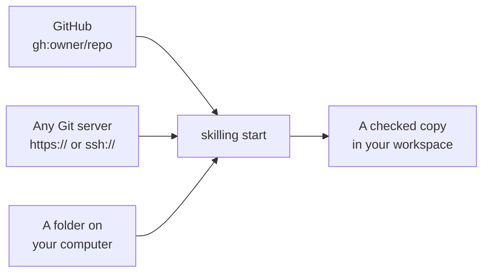

# Finding courses

## Courses to try

| Course | What you'll learn | Good for |
|---|---|---|
| [Welcome to Skilling](https://github.com/futureofdev/skilling/tree/main/examples/welcome-skilling) | How to learn well with an AI tutor | Everyone. Start here. |
| [Hello, Skilling](https://github.com/futureofdev/skilling/tree/main/examples/hello-skilling) | How a Skilling course is put together | Anyone curious about writing a course |
| [Workbench](https://github.com/futureofdev/skilling/tree/main/examples/workbench) | Files, folders and Git in the terminal | Getting comfortable with the terminal |

Course authors usually publish a ready-made `skilling start` command in their course's README.
Copy it, run it inside your workspace, and you're set.

## Where courses can come from



**GitHub.** The short form points at a repository, optionally pinned to a version and a
folder inside it:

```text
gh:owner/repository
gh:owner/repository@v1.0.0
gh:owner/repository@v1.0.0#courses/my-course
```

The part after `@` is the version. Pinning a version means you always get exactly what the
author tested. If you leave it off, you get whatever is there today. Your copy stays the same after
that, until you choose to update with `skilling upgrade`.

**Any Git server.** Use an `https://` or `ssh://` address for a course at the top of a
repository. These don't support the `@version` or `#folder` parts.

**A folder on your computer.** Any folder with a `course.yaml` file in it:

```bash
skilling start ../my-course my-learning --json
```

Skilling doesn't download ZIP files. If a course comes as a ZIP, unzip it yourself and point
Skilling at the folder.

## Private courses

If a course is in a private repository, Skilling uses whatever login Git already has on your
computer. There's no separate Skilling login. **Never put a password or token into a course
address.**

## Copies, not links

When you start a course, Skilling checks it and saves a copy in your workspace. You're taught
from that copy. Your course keeps working even if the original changes or disappears. To move
to a newer version, see [keeping things up to date](your-workspace#keeping-things-up-to-date).
