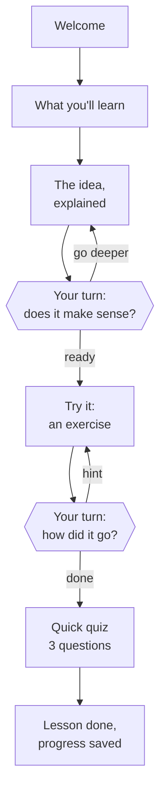
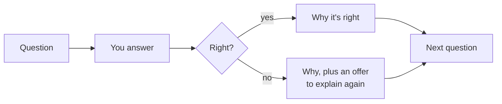

# Your first lesson

Every lesson follows the same pattern. Once you know it, every course feels familiar.

The lime six-sided boxes are where the tutor **stops and waits for you**. It won't move on
until you reply. The lime box at the end is your progress being saved. That pause is the whole point: it's where you think, and where the tutor finds out
what you understood.

## The rhythm: explain, question, revisit

1. **Explain.** The tutor explains one small idea, usually with an example.
2. **Question.** It asks you to say it back in your own words.
3. **Revisit.** If your answer shows a gap, it explains that part again, a different way.

The question isn't a test. A rough answer in your own words tells the tutor far more than a
perfect copy of its words.

## You're in charge

Interrupt whenever you like. Some things you can say:

| You want to... | Try saying |
|---|---|
| Slow down | "Can you go slower?" |
| See it another way | "Can you give me a different example?" |
| Go back | "I didn't get the second part. Can you go over it again?" |
| Go deeper | "Can you tell me more about that?" |
| Stop for today | "Let's stop here." |

Stopping is always safe. Your place is saved as you go. At worst, you pick up at the start of
the lesson you were on, and finished lessons are never lost.

## Exercises

Most lessons have a hands-on part. You might be asked to decide something, predict what will
happen, or explain your thinking. In practical courses you might create a file or run a
command.

Where it can, the tutor does the typing for you. **You make the decisions; it does the
fiddly bits.** It's fine to say "I'm stuck, can I have a hint?"

## When the assistant asks permission

Sometimes the assistant wants to run a command or change a file. It usually asks first. You'll
see what it wants to do and a choice like *Yes*, *Yes, and don't ask again*, or *No*.

- **Read what it wants to run.** Commands that start with `skilling` are Skilling saving your
  progress or fetching the next step. They're safe to approve.
- **If you're not sure, ask.** Type "What does that command do?" before you approve it.
- **You can always say no.** The tutor will find another way, or explain why it needed to.

## Quizzes

Every lesson ends with a short quiz: three questions, four choices each.

After every answer, right or wrong, the tutor tells you **why**. If you get one wrong, it offers
to go over the idea again. It's your choice. A wrong answer never stops you finishing the
lesson.

## At the end of a lesson

The tutor saves your progress and tells you what's next. At the end of a group of lessons
(a **phase**) there may be a small celebration, and sometimes homework.

Next: [progress and homework](progress-and-homework).
