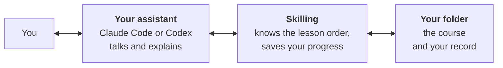
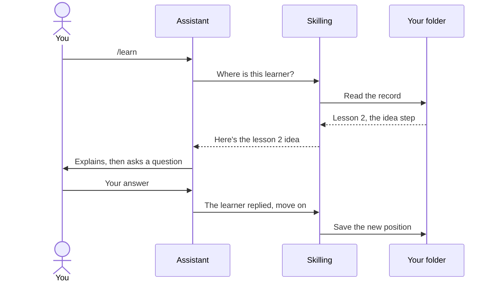
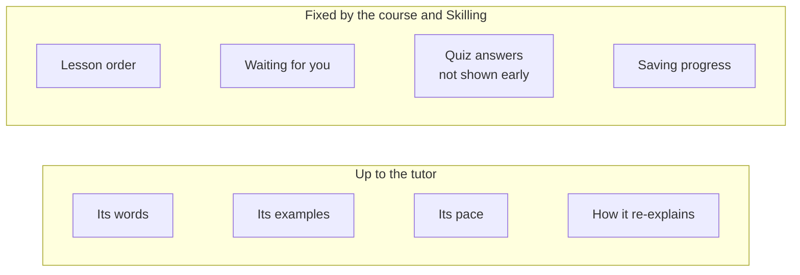

# Behind the scenes

You don't need to know any of this to learn. But if you're curious how it fits together, or
want to trust it, here's the picture.

## Three parts, three jobs

| Part | Its job | What it doesn't do |
|---|---|---|
| **Your assistant** | Talks to you. Explains, asks, listens, adapts. | Decide the lesson order, or keep the record. |
| **Skilling** | Says what comes next. Saves what's finished. | Think or talk. It has no AI inside. |
| **Your folder** | Holds the course and your record as plain files. | Depend on any one company. |

## What happens when you type /learn

The assistant asks Skilling at every step. That's how the tutor knows where you are, even in a
brand new chat on a different day.

## Why your progress isn't in the chat

If your progress lived in a chat, you'd lose it whenever the chat ended, or if you switched to
a different assistant. So Skilling keeps a small record file instead. It holds:

- which lessons you've finished, and when,
- where you are now,
- your streak and badges,
- your homework.

It **doesn't** store the conversation. Any tutor that follows the Skilling format can read the
record and carry on, so you can switch between Claude Code and Codex in the same folder.

Next to the record is a **completion log** with one line per finished lesson. It's only ever
added to, never rewritten. If the two ever disagree, the log wins, and the record can be
rebuilt from it.

## What the tutor decides, and what it doesn't

This split is on purpose. No one can force an AI to teach well. But Skilling can make sure the
parts around it are right, and those parts are tested.

## Limits worth knowing

- **The record says what you finished, not how well you understood it.** A quiz score is never
  treated as proof that you've mastered something.
- **The AI can make mistakes.** If something seems wrong, ask it to check or explain again.
- **Practical tasks need an assistant that can look at your files.** That's one more reason
  Skilling uses a coding assistant rather than a chat website.

Next: [your workspace](your-workspace).
