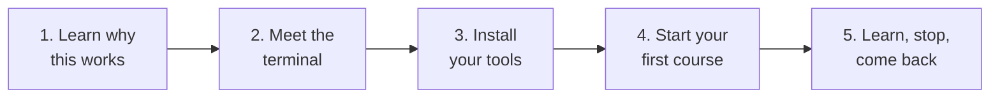

# Learning with Skilling

Skilling turns an AI coding assistant into a patient, one-to-one tutor. You pick a course. The
assistant teaches it to you a little at a time: it explains, asks you questions, listens, and
explains again when something doesn't click. Your progress is saved on your own computer, so
you can stop and come back whenever you like.

**You don't need to know how to code.** You don't need Python, and you don't need to have used
Claude or Codex before. These pages start from zero.

## The whole journey

| Step | Page | Time |
|---|---|---|
| 1 | [Why learn this way](why.md) | 5 minutes |
| 2 | [The terminal, gently](terminal.mdx) | 10 minutes |
| 3 | [Install your tools](install.mdx) | 15–30 minutes, once |
| 4 | [Start your first course](start.mdx) | 5 minutes |
| 5 | [Your first lesson](first-lesson.md) | As long as you like |

If you already use Claude Code or Codex every day, skip straight to
[start your first course](start.mdx).

## What you'll need

- A computer running **macOS, Windows or Linux**.
- An internet connection while you set up and while you learn. The AI part runs in the cloud.
- An account for **one** AI assistant: Claude Code (from Anthropic) or Codex (from OpenAI).
  Both need a paid plan. [Install your tools](install.mdx) explains the options.

Skilling itself is free and open source.

## Once you're set up

- [Progress and homework](progress-and-homework.md): see how you're doing, and how homework works.
- [Behind the scenes](how-it-works.md): what Skilling, the assistant and your files each do.
- [Your workspace](your-workspace.md): add courses, update, and move your learning to another computer.
- [Finding courses](courses.md) and [troubleshooting](troubleshooting.md).
- [Words you'll see](glossary.md): plain explanations of every technical word on these pages.
