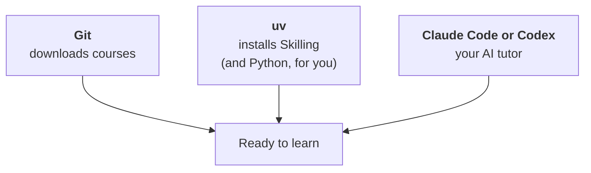

import Tabs from '@theme/Tabs';
import TabItem from '@theme/TabItem';

# Install your tools

You install three things, once. After that, starting a new course takes one command.



| Tool | What it's for | Cost |
|---|---|---|
| **Git** | Downloads courses from the internet and keeps track of versions. | Free |
| **uv** | Installs Skilling. It also fetches Python automatically, so **you never install Python yourself**. | Free |
| **Claude Code** *or* **Codex** | The AI assistant that does the teaching. You only need one. | Paid plan |

:::tip[Close and reopen the terminal after each install]
A terminal window only notices new programs when it starts. If a command says
"not found" straight after installing, close the window and open a new one.
:::

## Step 1: choose your assistant

Both work the same way with Skilling. If you already pay for one of them, use that one.

| | Claude Code | Codex |
|---|---|---|
| Made by | Anthropic | OpenAI |
| Account you need | A paid Claude plan (Pro, Max, Team or Enterprise), or an Anthropic Console account | A ChatGPT plan that includes Codex (Plus, Pro, Business, Edu or Enterprise), or an OpenAI API key |
| Start it with | `claude` | `codex` |
| Start a lesson with | `/learn` | `$learn` |
| Official guide | [Claude Code setup](https://code.claude.com/docs/en/setup) | [Codex CLI](https://github.com/openai/codex) |

Plans and prices change, so check the official pages before you sign up. Free plans may not
include these assistants.

## Step 2: install Git

<Tabs groupId="os">
<TabItem value="mac" label="macOS" default>

Paste this into the terminal and press **Enter**:

```bash
git --version
```

If it prints a version number, Git is already installed. Go to step 3.

If a window pops up offering to install the **command line developer tools**, click
**Install** and wait for it to finish (it can take a few minutes). Then run `git --version`
again.

</TabItem>
<TabItem value="windows" label="Windows">

1. Go to [git-scm.com/downloads/win](https://git-scm.com/downloads/win) and download
   **Git for Windows**.
2. Run the installer. The default answer to every question is fine. Just keep clicking
   **Next**, then **Install**.
3. Close PowerShell, open a new one, and check:

```powershell
git --version
```

Claude Code can also use Git for Windows to run commands, if it's installed.

</TabItem>
<TabItem value="linux" label="Linux">

Use your system's package manager. On Ubuntu or Debian:

```bash
sudo apt update && sudo apt install git
```

On Fedora:

```bash
sudo dnf install git
```

`sudo` asks for your computer password. Nothing appears while you type it. That's normal.
Then check with `git --version`.

</TabItem>
</Tabs>

## Step 3: install uv

<Tabs groupId="os">
<TabItem value="mac" label="macOS" default>

```bash
curl -LsSf https://astral.sh/uv/install.sh | sh
```

</TabItem>
<TabItem value="windows" label="Windows">

```powershell
powershell -ExecutionPolicy ByPass -c "irm https://astral.sh/uv/install.ps1 | iex"
```

</TabItem>
<TabItem value="linux" label="Linux">

```bash
curl -LsSf https://astral.sh/uv/install.sh | sh
```

</TabItem>
</Tabs>

Close the terminal, open a new one, and check:

```bash
uv --version
```

These commands come from [uv's official guide](https://docs.astral.sh/uv/getting-started/installation/),
which also lists other ways to install it.

## Step 4: install your assistant

<Tabs groupId="assistant">
<TabItem value="claude" label="Claude Code" default>

<Tabs groupId="os">
<TabItem value="mac" label="macOS" default>

```bash
curl -fsSL https://claude.ai/install.sh | bash
```

Claude Code needs macOS 13 or newer.

</TabItem>
<TabItem value="windows" label="Windows">

```powershell
irm https://claude.ai/install.ps1 | iex
```

Claude Code needs Windows 10 (version 1809) or newer.

</TabItem>
<TabItem value="linux" label="Linux">

```bash
curl -fsSL https://claude.ai/install.sh | bash
```

</TabItem>
</Tabs>

Open a new terminal and start it:

```bash
claude
```

The first time, it asks you to sign in. A browser window opens. Log in with your Claude
account, then come back to the terminal. To leave Claude Code, type `/exit` (or press **Ctrl + C** twice).

</TabItem>
<TabItem value="codex" label="Codex">

<Tabs groupId="os">
<TabItem value="mac" label="macOS" default>

```bash
curl -fsSL https://chatgpt.com/codex/install.sh | sh
```

</TabItem>
<TabItem value="windows" label="Windows">

```powershell
powershell -ExecutionPolicy ByPass -c "irm https://chatgpt.com/codex/install.ps1 | iex"
```

</TabItem>
<TabItem value="linux" label="Linux">

```bash
curl -fsSL https://chatgpt.com/codex/install.sh | sh
```

</TabItem>
</Tabs>

Open a new terminal and start it:

```bash
codex
```

The first time, choose **Sign in with ChatGPT**. A browser window opens. Log in, then come
back to the terminal. To leave Codex, type `/exit` (or press **Ctrl + C** twice).

</TabItem>
</Tabs>

These commands come from the official [Claude Code](https://code.claude.com/docs/en/setup)
and [Codex](https://github.com/openai/codex) guides. If they've changed, follow those guides.

## Step 5: check everything

Open a new terminal and run each line. Every one should print a version number.

```bash
git --version
uv --version
claude --version
```

Use `codex --version` instead of `claude --version` if you chose Codex.

If any of them says "not found", see [troubleshooting](troubleshooting#a-tool-isnt-found).

You don't need to install Skilling yourself. The next page does it for you. Next,
[start your first course](start).
