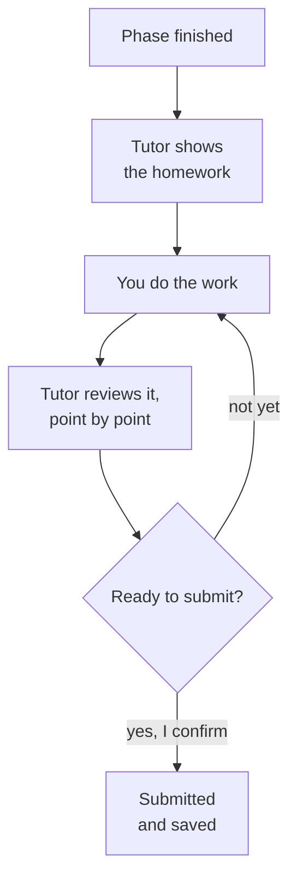

# Progress and homework

## How am I doing?

Just ask the tutor: **"How am I doing?"** Or type `/progress` in Claude Code, `$progress` in
Codex. You'll see:

- the lessons you've finished,
- where you are in the course,
- your streak (how many days in a row you've learned),
- any badges you've earned.

These numbers are read from your saved record **every time you ask**. The tutor never
guesses them or remembers them from earlier in the chat.

You can also check yourself from the terminal, from anywhere inside your learning folder:

```bash
skilling courses --json
skilling progress --course welcome-skilling
```

## Homework

Some courses set homework at the end of a phase. It's a short task with a checklist, like
"write down one goal and one next step".



A few things to know:

- **Reviewing isn't submitting.** The tutor gives feedback as often as you like. Nothing is
  submitted until you clearly say so.
- **Every checklist item gets its own feedback,** so you know exactly what's done and what
  isn't yet.
- **Stretch goals are optional.** They get feedback too, but never hold you back.

Type `/homework` (or `$homework` in Codex) any time to ask what's due or to get feedback.

## Where your work goes

Each course gets its own folder inside `showcase/` in your learning folder. That's where your
notes, code and anything else you make should go. It's yours: keep it, share it, or put it in
Git.

Next: [what happens behind the scenes](how-it-works).
