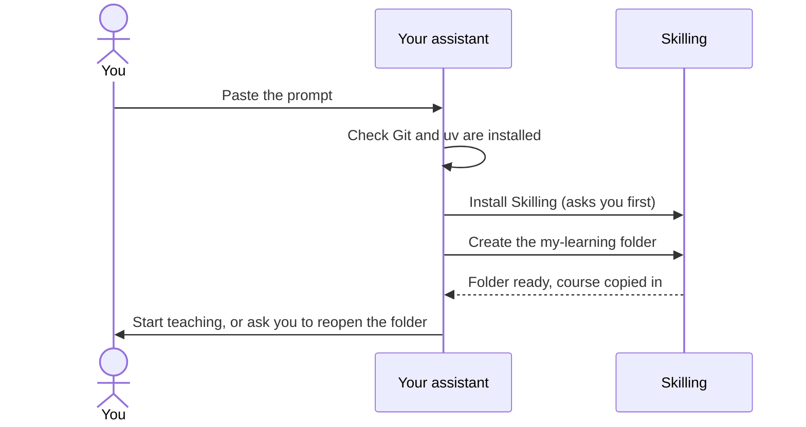
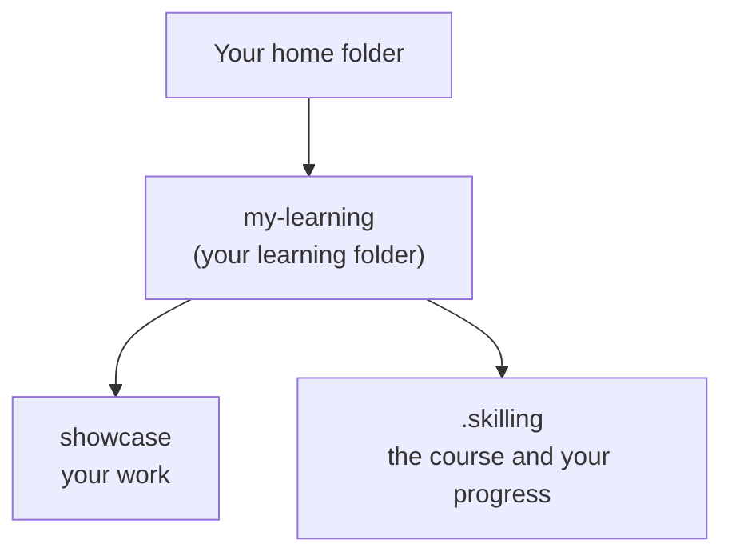

import Tabs from '@theme/Tabs';
import TabItem from '@theme/TabItem';
import {StartPrompt, StartCommands} from '@site/src/components/StartPrompt';

# Start your first course

You'll set up a **learning folder** called `my-learning` and start the *Welcome to Skilling*
course. It's two short lessons, about five minutes each, on how to get the most out of being
tutored.

Before you start, you need Git, uv and Claude Code or Codex. If you don't have them yet,
[install your tools](install) first.

There are two ways to do it. Both end up in the same place.

## The easy way: paste one prompt

**1. Open the terminal** and start your assistant:

<Tabs groupId="assistant">
<TabItem value="claude" label="Claude Code" default>

```bash
claude
```

</TabItem>
<TabItem value="codex" label="Codex">

```bash
codex
```

</TabItem>
</Tabs>

**2. Paste this prompt** into the assistant and press **Enter**. Use the copy button in the top
corner of the box.

<StartPrompt />

**3. Say yes when it asks.** The assistant will want to run a few commands, such as
`uv tool install skilling`. It usually asks your permission first. Read what it wants to run, then
approve it.

Here's what happens next:



**4. You may need to reopen it.** Your assistant only notices new skills in a folder when it
starts. If it tells you to reopen, do this:

<Tabs groupId="assistant">
<TabItem value="claude" label="Claude Code" default>

Type `/exit` and press **Enter** to leave Claude Code. Then, back in the terminal:

```bash
cd my-learning
claude
```

Then type `/learn` and press **Enter**.

</TabItem>
<TabItem value="codex" label="Codex">

Type `/exit` and press **Enter** to leave Codex. Then, back in the terminal:

```bash
cd my-learning
codex
```

Then type `$learn` and press **Enter**.

</TabItem>
</Tabs>

The first time you open a folder, your assistant may ask whether you trust it. Your learning
folder is safe to trust.

## Type the commands yourself

If you'd rather run the setup by hand, paste these into the terminal one at a time:

<StartCommands />

The last command prints a block of text. (`--json` just means "print the result in a tidy,
machine-readable format".) Look for `"workspace"`: that's the **path**, the full address, of
your new learning folder. Then go into it and start your assistant:

<Tabs groupId="assistant">
<TabItem value="claude" label="Claude Code" default>

```bash
cd my-learning
claude
```

Type `/learn` and press **Enter**.

</TabItem>
<TabItem value="codex" label="Codex">

```bash
cd my-learning
codex
```

Type `$learn` and press **Enter**.

</TabItem>
</Tabs>

## Where did everything go?

The `my-learning` folder is created inside whichever folder your terminal was in, usually your
home folder. You can see it in Finder, File Explorer or your file manager like any other folder.



Learn more in [your workspace](your-workspace).

## Coming back tomorrow

Open the terminal, go into your folder, start your assistant, and ask for the next lesson:

```bash
cd my-learning
claude
```

Then `/learn` (or `codex`, then `$learn`). The tutor checks your saved progress and carries on
from where you stopped.

Next: [your first lesson](first-lesson).
