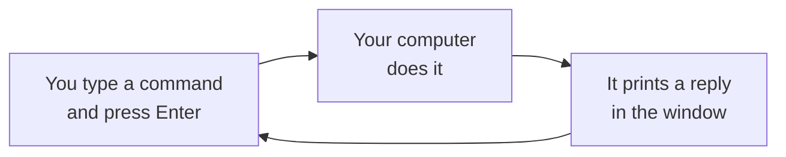

import Tabs from '@theme/Tabs';
import TabItem from '@theme/TabItem';

# The terminal, gently

Claude Code and Codex run in the **terminal**. If you've never used one, this page is for you.
You only need a few small skills, and you can't break anything by reading along.

## What is the terminal?

The terminal is a window where you type instructions to your computer instead of clicking. You
type a line (a **command**), press **Enter**, and the computer replies with some text.



That's all it is. It looks old-fashioned, but it's how many developer tools work, including
the AI assistants Skilling uses.

## Open the terminal

<Tabs groupId="os">
<TabItem value="mac" label="macOS" default>

1. Press **Cmd + Space** to open Spotlight.
2. Type `Terminal` and press **Enter**.

A window opens with a line ending in `%` or `$`. That's the **prompt**: the computer is waiting
for you to type.

</TabItem>
<TabItem value="windows" label="Windows">

1. Press the **Windows key**.
2. Type `PowerShell` and press **Enter**.

A window opens with a line like `PS C:\Users\you>`. That's the **prompt**: the computer is
waiting for you to type. The `PS` means you're in PowerShell, which is what these guides use.

</TabItem>
<TabItem value="linux" label="Linux">

Press **Ctrl + Alt + T**, or search for "Terminal" in your applications menu.

A window opens with a line ending in `$`. That's the **prompt**: the computer is waiting for
you to type.

</TabItem>
</Tabs>

## Try your first command

Type this and press **Enter**:

```bash
echo hello
```

The computer replies `hello`. You've just used the terminal.

## Copy and paste

You'll mostly copy commands from these pages rather than typing them. Every code box on this
site has a copy button in its top-right corner.

| | Paste into the terminal |
|---|---|
| macOS | **Cmd + V** |
| Windows (PowerShell) | **Ctrl + V**, or right-click |
| Linux | **Ctrl + Shift + V** |

After pasting, press **Enter** to run it.

## Folders, and where you are

The terminal is always "in" a folder, just like a file browser window. When you first open it,
you're in your **home folder** (the one with your name).

| To... | Type | Example |
|---|---|---|
| See where you are | `pwd` | `/Users/sam` |
| List what's in this folder | `ls` | `Desktop  Documents  Downloads` |
| Go into a folder | `cd` and the folder's name | `cd my-learning` |
| Go back up one level | `cd ..` | |

When a Skilling page says "open the folder in your assistant", it means: `cd` into the folder,
then start the assistant there.

## Things that worry people

- **"Nothing happened."** Many commands print nothing when they work. A new prompt line means
  it's finished.
- **"It's still running."** Some commands take a minute. Wait until the prompt comes back.
- **"I want to stop something."** Press **Ctrl + C**. It cancels whatever is running.
- **"It says command not found."** The program isn't installed yet, or the terminal needs
  restarting after an install. Close the window, open a new one, and try again.
- **"Will I break my computer?"** The commands in these guides only install tools and create
  folders. The AI assistant usually asks before it runs a command or changes a file.

Next, [install your tools](install).
