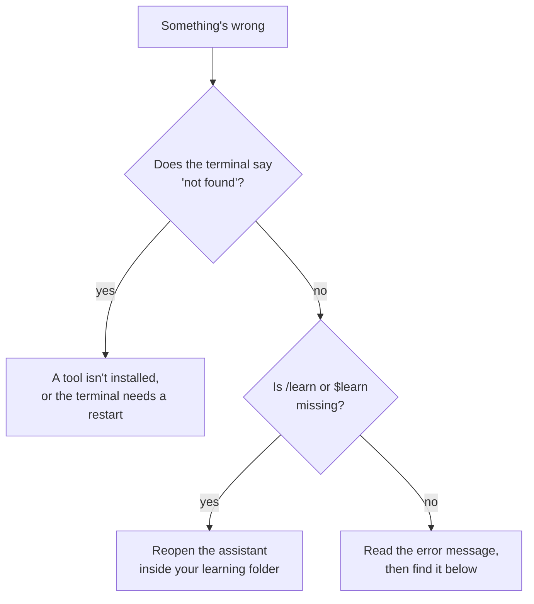

# Troubleshooting

First, the golden rule: **don't delete the `.skilling` folder.** It holds your progress, and
fixing most problems needs the files inside it.



## A tool isn't found

You see something like `command not found: skilling`, or `'uv' is not recognized`.

1. **Close the terminal and open a new one.** New programs only show up in new windows.
2. Check each tool: `git --version`, `uv --version`, `skilling --version`.
3. If one is missing, install it again from [install your tools](install). For Skilling:

```bash
uv tool install skilling
skilling --version
```

4. If uv says its tool folder isn't on your `PATH`, run `uv tool update-shell`, then open a new
   terminal. (`PATH` is the list of places your computer looks for programs.)
5. If the terminal finds the tool but your assistant doesn't, quit the assistant and start it
   again from a new terminal.

## `/learn` or `$learn` doesn't exist

The learning skills live inside your learning folder, so your assistant has to be started
**in that folder**.

1. Leave the assistant: type `/exit` (this works in both Claude Code and Codex).
2. `cd my-learning`
3. Start it again (`claude` or `codex`) and type `/learn` or `$learn`.

Remember: Claude Code uses `/`, Codex uses `$`.

If the skill files have gone missing, run your original `skilling start` command again. It's
safe to repeat and puts them back.

## The course can't be downloaded

- Check the spelling of the course address.
- Check Git works: `git --version`.
- For a private course, check you can reach the repository with Git on its own.
- Only the GitHub short form (`gh:...`) supports `@version` and `#folder`. See
  [finding courses](courses).

## A command can't find your workspace

Run it from inside your learning folder, or any folder inside it. If you moved the workspace,
make sure you moved the **whole** folder, not just `showcase/`.

## `version-mismatch`

Your progress belongs to a different version of the course than the one in your folder. Nothing
has been changed. Type `/upgrade-skilling` (or run `skilling upgrade --course <course-id>`) to
see whether your progress can carry over.

## Windows: the install command fails

- Make sure you're in **PowerShell** (the prompt starts with `PS`), not the older Command Prompt.
- If you see a message about scripts being disabled, use the full commands from
  [install your tools](install). They include `-ExecutionPolicy ByPass` for this reason.

## Still stuck?

Ask your assistant! Paste the error message and say "This happened while setting up Skilling.
What does it mean?" It can usually explain.

If it's a bug, [open an issue](https://github.com/futureofdev/skilling/issues). Include your
Skilling version (`skilling --version`), your operating system, the command you ran and what
it printed. **Leave out any passwords, tokens or private course content.** Rarer problems are
covered in the
[full troubleshooting reference](https://github.com/futureofdev/skilling/blob/main/docs/troubleshooting.md).
