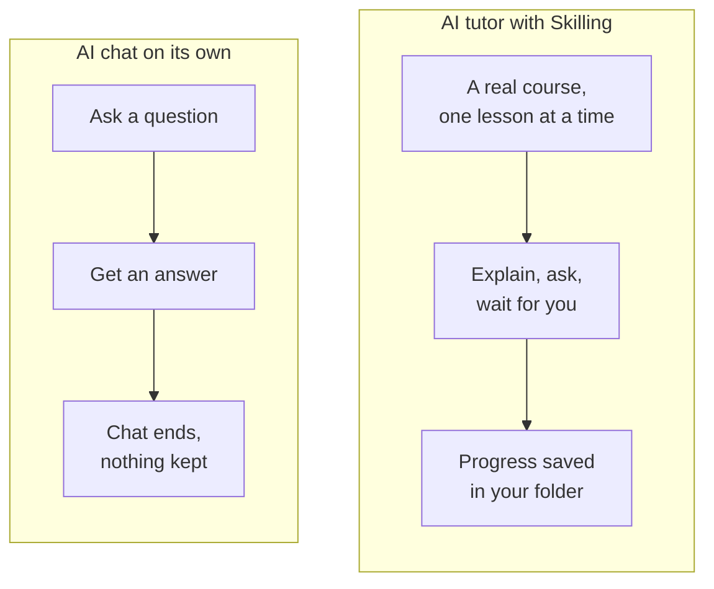

# Why learn this way

## One-to-one tutoring works

In 1984 an education researcher, Benjamin Bloom, compared students taught in a normal class
with students who had a personal tutor. The tutored students did far better. The average
tutored student did better than about 98% of the class. This became known as the
**"two sigma" result**. Later studies found smaller gains, but tutoring still comes out as one
of the most effective ways to learn.

The reason isn't magic. A good tutor:

- explains one thing at a time,
- checks you understood before moving on,
- notices exactly where you got confused,
- explains that part again in a different way,
- goes at your pace, not the class's.

The problem Bloom pointed out was cost. Nobody can afford a personal tutor for every learner.

## An AI can be that tutor

Modern AI models can explain things clearly, answer follow-up questions, and try a different
example when the first one didn't land. They don't get impatient, and they're there whenever
you have time.

But an AI on its own has some real weaknesses as a teacher:

| On its own, an AI chat... | So Skilling... |
|---|---|
| makes up a lesson plan as it goes | gives it a course written by a person, in a fixed order |
| may rush ahead or answer its own questions | makes it stop and wait for your real answer |
| forgets you when the chat ends | saves your progress in a file on your computer |
| can't tell you what you've finished | keeps a record you can check at any time |
| is different every time | teaches everyone the same course, so you can compare notes |

## Why a coding assistant, not a chat website?

You might wonder why Skilling uses Claude Code or Codex rather than the normal Claude or
ChatGPT websites. It's because a coding assistant runs **on your computer**, inside a folder.
That changes what it can do for you:

- **It can save things.** Your progress, your notes and your work are saved as real files in
  your folder, not stuck inside a chat history.
- **It can look at your work.** If a lesson asks you to create a file or run a command, the
  assistant can check that you really did it.
- **It can do the fiddly typing.** You make the decisions. The assistant can type the commands
  and edit files for you, and it usually asks your permission first.
- **It follows instructions in the folder.** Skilling puts small instruction files (called
  *skills*) in your learning folder, so the assistant knows exactly how to teach a Skilling
  course.

Don't worry about the name. A "coding" assistant is just an AI that can work with files and
commands. You can use it to learn anything a course covers, not only programming.

## What Skilling adds

Skilling is the bit in the middle. It's a small, free program that:

1. **Fetches a course** and saves a checked copy in your learning folder.
2. **Tells the assistant how to teach it**, one step at a time.
3. **Keeps your record**: which lessons you've finished, your streak, and your homework.

Skilling has no AI inside it. The thinking and talking come from your assistant. Skilling
makes sure the lessons happen in the right order and that your progress is saved properly.

## Honest limits

- **The AI can be wrong.** It's very good, but not perfect. If something sounds off, ask it to
  explain again or check another source.
- **A quiz isn't proof.** Getting quiz questions right shows you're on track. It doesn't prove
  you've mastered something.
- **It costs money.** Skilling is free, but Claude Code and Codex need a paid plan.
- **It's still new.** Skilling is an open project and it's young. See
  [the format's status](../write/status).

Ready? Next, [meet the terminal](terminal).
