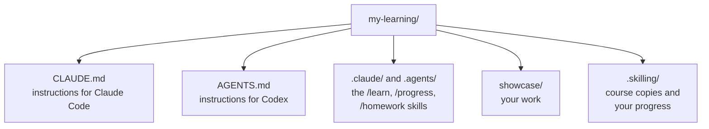
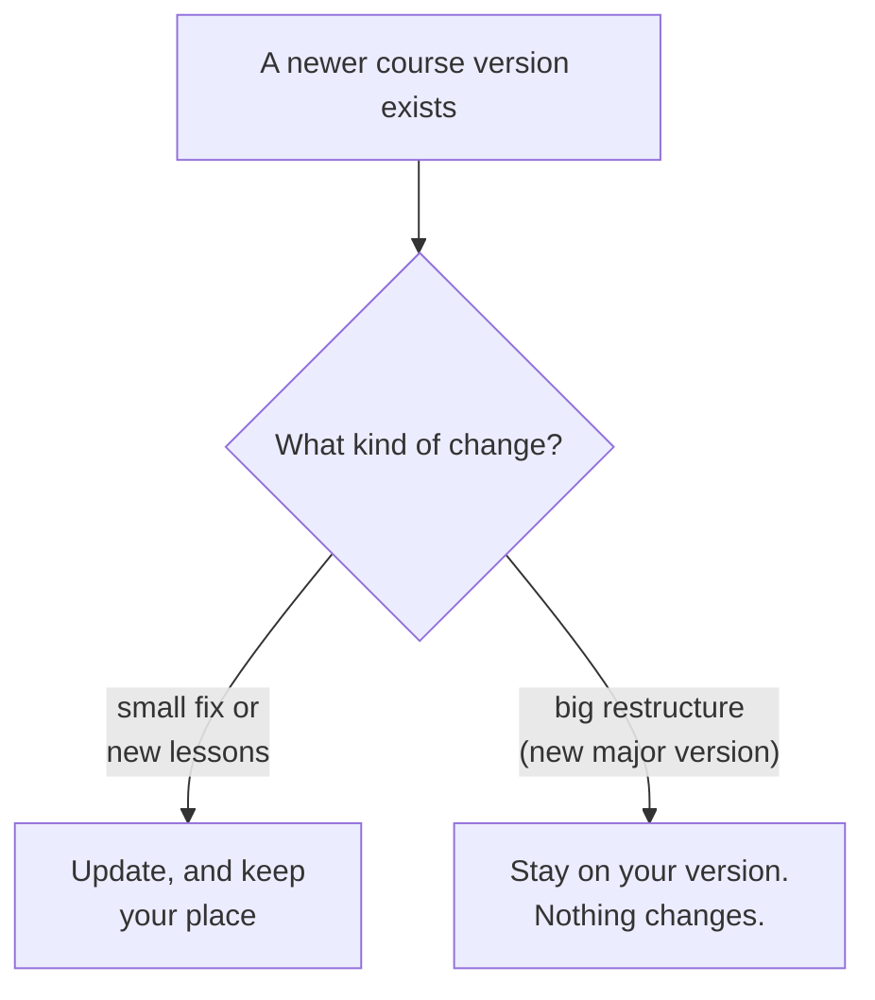

# Your workspace

Your learning folder is called a **workspace**. Everything about your learning lives inside it.



| Part | Whose is it? | Can I edit it? |
|---|---|---|
| `showcase/` | Yours | Yes. Put your notes and work here. |
| `.skilling/` | Skilling's | **No.** Don't edit or delete it. It holds your progress. |
| `CLAUDE.md`, `AGENTS.md`, `.claude/`, `.agents/` | Your assistant's | No need. Skilling keeps them up to date. |

Folders that start with a dot (`.skilling`) are hidden by default. That's normal.

You can work from any folder inside the workspace, for example `showcase/welcome-skilling/`,
and Skilling still finds your progress.

## Adding another course

Go into your workspace and run `start` again, with the new course and a single dot (`.`),
which means "this folder":

```bash
cd my-learning
skilling start 'gh:owner/repository@v1.0.0#path/to/course' . --json
```

Course authors usually give you this exact command. It adds the new course next to your
existing ones and never replaces your other courses, progress or work.

## Keeping things up to date

Type `/upgrade-skilling` in Claude Code, or `$upgrade-skilling` in Codex. The tutor asks
before every check and every change. It can update Skilling itself, and check whether a course
has a newer version.



You can also check from the terminal:

```bash
skilling upgrade --course welcome-skilling          # just report, change nothing
skilling upgrade --course welcome-skilling --yes    # update, keeping your progress
```

Running `start` again with the same course never updates it. Only `upgrade` does.

## Moving to another folder or computer

Copy or move the **whole** workspace folder, hidden files included. On a new computer, install
your tools first ([Git, uv and your assistant](install), then `uv tool install skilling`), then
open the moved folder.

Copying only `showcase/` keeps your work but not your progress.

## Offline

Once a course is set up, Skilling, the course and your progress all work without the internet.
Your AI assistant still needs its normal connection, because the AI runs in the cloud.
