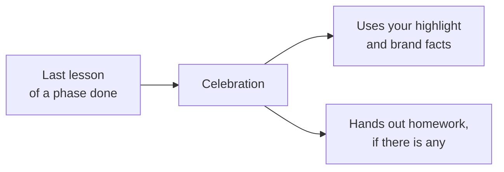

# Badges, celebrations and images

None of these are required. Add them when they help.

## Badges

Register badges in `course.yaml`, then award them from a lesson:

```yaml title="course.yaml"
skills:
  - { id: mindful-brewer, name: Mindful Brewer }
```

```yaml title="lesson frontmatter"
skills_unlocked: [mindful-brewer]
```

When the learner finishes that lesson, the badge is saved to their record. Every badge a lesson
awards must be registered in `skills`, so a learner can never "earn" something that doesn't
exist.

A badge says a lesson was finished. It isn't a claim that the learner mastered anything. That's
what [objectives](objectives-quizzes-homework#objectives) are for.

## Phase highlights and celebrations

At the end of each phase, the tutor celebrates. Give it something specific to celebrate with a
`highlight` on the phase:

```yaml
phases:
  - number: 1
    slug: basics
    name: Tea Basics
    highlight: brewed a cup of tea on purpose
```

Write the highlight **without pronouns** ("brewed a cup", not "brewed their cup"). The tutor
might use it as "they brewed..." and a share message as "I brewed...".



### Brand facts

If your course belongs to a product or community, give the tutor the facts it must not guess:

```yaml
ceremony:
  brand:
    product: Tea Club
    url: example.com/tea-club
    mention: "@teaclub"
    hashtags: [Tea, LearnSomething]
```

The tutor writes the celebration in its own words, using your facts. That's usually better
than a fixed template, because each learner gets something written for them.

If the wording must be exact, for example a legal line, you can add a
`phase_completed_template` with placeholders like `{phase_name}` and `{phase_highlight}`. See
[ceremony in the specification](/spec/course-format#ceremony) for every placeholder.

## Images and files

Put images, diagrams and data files in an `assets/` folder at the top of the course, and link
to them with a relative path:

```markdown

```

Paths must stay inside the course folder. The validator reports missing files, so a deleted
image fails the check instead of confusing a learner. Link to large video or audio rather than
putting it in the course.
