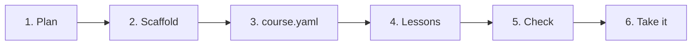

# Your first course

In this walkthrough you'll build a small but complete course: **Brew a Better Cup of Tea**. It
has one phase and two lessons. Every file below passes the validator, so you can copy them as a
starting point.



## Step 1: plan before you write

Answer three questions on paper first:

1. **Who is it for?** People who drink tea but have never thought about how they make it.
2. **What will they be able to do at the end?** Choose a water temperature and steeping time,
   and brew one cup on purpose.
3. **What are the steps to get there?** First understand water and time, then put it together.

Each step usually becomes one lesson. Aim for lessons that take 5 to 20 minutes.

## Step 2: make a starter course

```bash
skilling init better-tea
```

This makes a folder that already passes the validator:

```text
better-tea/
├── course.yaml
└── phases/
    └── phase-1-basics/
        ├── overview.md
        ├── lesson-01-first-steps.md
        └── lesson-02-going-further.md
```

Lesson file names follow a fixed pattern: `lesson-` plus a two-digit number plus the lesson's
short name. You'll rename them in step 4 to match your own lessons.

## Step 3: describe the course in `course.yaml`

`course.yaml` is the course's table of contents. It says what the course is called, how it's
laid out, and how the tutor should sound.

```yaml title="course.yaml"
spec_version: "1.4"
id: better-tea
title: Brew a Better Cup of Tea
version: "1.0.0"
description: Learn why water temperature and steeping time change how tea tastes, and brew one cup on purpose.
language: en
license: CC-BY-4.0
authors:
  - Sam Example
tutor:
  persona: >
    A friendly tea enthusiast who explains one idea at a time,
    uses everyday examples, and checks in before moving on.
  tone:
    - Warm and plain, never fussy
    - Ask before changing pace or picking an example for the learner
phases:
  - number: 1
    slug: basics
    name: Tea Basics
    highlight: brewed a cup of tea on purpose
    lessons:
      - { number: 1, slug: water-and-time, title: Water and Time }
      - { number: 2, slug: your-perfect-cup, title: Your Perfect Cup, homework: true }
skills:
  - { id: mindful-brewer, name: Mindful Brewer }
```

| Field | What it does |
|---|---|
| `spec_version` | Which version of the Skilling format you're using. |
| `id` | A short, permanent name. Lowercase letters, numbers and hyphens only. |
| `version` | Your course's own version. Start at `1.0.0`. See [updating a published course](updates). |
| `tutor` | How the tutor should sound. This is guidance for the AI, not a script. |
| `phases` | Groups of lessons, in order. Each lesson has a number, a short name (`slug`) and a title. |
| `homework: true` | This lesson has homework. Put it on the **last lesson of a phase**. |
| `highlight` | What the learner achieved in this phase, used in the celebration. |
| `skills` | Badges the course can award. |

### Rules worth knowing early

- **Never change `id` after people start the course.** Their progress is saved under it.
- **Don't write counts.** Don't say "this course has 2 lessons" anywhere. Skilling works counts
  out from `course.yaml`, so they can never be wrong.
- **Unknown fields are errors.** A typo like `descripton:` is reported, not ignored.

## Step 4: write the lessons

Rename the lesson files to match your `course.yaml`:

```text
phases/phase-1-basics/lesson-01-water-and-time.md
phases/phase-1-basics/lesson-02-your-perfect-cup.md
```

The phase overview is shown when the phase begins. It has no required shape:

```markdown title="phases/phase-1-basics/overview.md"
# Tea Basics

By the end of this phase you'll know the two things that change a cup of tea the most, and
you'll have brewed one cup on purpose instead of by habit.
```

Here's the complete first lesson. Every lesson has the same parts in the same order. See
[anatomy of a lesson](lesson-anatomy) for what each part is for.

````markdown title="phases/phase-1-basics/lesson-01-water-and-time.md"
---
title: Water and Time
phase: 1
lesson: 1
duration_minutes: 10
prerequisites: []
skills_unlocked: []
objectives:
  - id: explain-temperature
    kind: knowledge
    text: Explain why green tea needs cooler water than black tea
    about: [1, 2]
  - id: explain-steeping
    kind: knowledge
    text: Say what happens to tea when it steeps for too long
    about: [3]
sections:
  key_terms: present
  exercise: present
  next_up: present
---

## The Concept
Two things change a cup of tea more than anything else: **how hot the water is** and **how
long the leaves stay in it**.

Hot water pulls flavour out of tea leaves quickly. That's good for sturdy black tea. Delicate
green tea is different: boiling water pulls out its bitter parts too fast, so it tastes harsh.
Water that has cooled for a couple of minutes, to around 80°C, gives a softer, sweeter cup.

Time works the same way. The first few minutes bring out flavour. After that, the leaves keep
releasing bitter compounds, so a cup left steeping for ten minutes tastes stronger but also
rougher.

### A worked example
Picture two cups of the same green tea. One is made with boiling water and left for five
minutes. The other uses slightly cooled water and comes out after two minutes. The first is
bitter and dark. The second is lighter and sweeter. Same leaves, different choices.

## Key Terms
- **Steeping**: Leaving tea leaves in hot water so the flavour comes out
- **Bitterness**: A harsh taste that comes from steeping too hot or too long

## Hands-On Exercise
Think of the last cup of tea you made. Tell your tutor what kind of tea it was, roughly how hot
the water was, and how long you left it. Then predict one change that would make it taste
better, and say why you think so.

## Quick Quiz
1. Why does green tea often taste bitter with boiling water?
   - a) Boiling water removes the caffeine
   - b) Very hot water pulls out the bitter parts too quickly
   - c) Green tea leaves are always bitter
   - d) Boiling water makes the tea weaker

   **Answer:** b) Very hot water pulls out the bitter parts too quickly — green tea is
   delicate, so cooler water gives a softer taste.

2. Which tea is usually fine with water straight off the boil?
   - a) Green tea
   - b) White tea
   - c) Black tea
   - d) None of them

   **Answer:** c) Black tea — it's sturdy enough that very hot water brings out flavour
   without too much harshness.

3. What mostly happens when tea steeps for far too long?
   - a) It gets stronger and more bitter
   - b) It gets sweeter
   - c) It goes cold and loses all flavour
   - d) Nothing changes after two minutes

   **Answer:** a) It gets stronger and more bitter — the leaves keep releasing bitter
   compounds after the flavour has come out.

## Next Up
Next you'll put both ideas together and brew one cup on purpose.
````

And the second lesson. It shows three more things: a **practice** objective (something the
learner does), sections left out **on purpose** with a reason, and **homework**.

````markdown title="phases/phase-1-basics/lesson-02-your-perfect-cup.md"
---
title: Your Perfect Cup
phase: 1
lesson: 2
duration_minutes: 15
prerequisites: ["1.1"]
skills_unlocked: [mindful-brewer]
objectives:
  - id: plan-a-brew
    kind: knowledge
    text: Choose a water temperature and steeping time for a tea, and explain the choice
    about: [1, 2, 3]
  - id: brew-and-record
    kind: practice
    text: Brew one cup on purpose and write down what you did and how it tasted
    verify: A brewing note exists in the learner's showcase folder with the tea, temperature, time and a taste note
sections:
  key_terms:
    status: none
    intent: "No new words in this lesson; it applies the terms from lesson 1."
  exercise: present
  next_up:
    status: none
    intent: "Last lesson of the course, so there is nothing to tease."
---

## The Concept
A good cup of tea is a small plan: pick your tea, pick a water temperature, pick a time, then
taste and adjust. Writing the plan down is what turns a lucky cup into one you can repeat.

A simple starting point: black tea with just-boiled water for three to four minutes, and green
tea with slightly cooled water for about two minutes. These aren't rules. They're a place to
start, and your taste decides the rest.

### A worked example
Say your usual black tea tastes too strong. Your plan might be: same water, but take the bag
out after three minutes instead of five. Then you taste it and note whether that fixed it.

## Hands-On Exercise
Choose a tea you have at home. Tell your tutor your plan before you start: the tea, the water
temperature and the steeping time, and why you picked them. Brew it, taste it, and describe the
result. Your tutor can save your note in your showcase folder.

## Quick Quiz
1. What turns a lucky cup of tea into one you can repeat?
   - a) Using the most expensive tea
   - b) Writing down what you did
   - c) Always using boiling water
   - d) Steeping for as long as possible

   **Answer:** b) Writing down what you did — a note of the tea, temperature and time lets you
   repeat it or adjust it next time.

2. Your black tea tastes too strong. What is a sensible first change?
   - a) Use colder milk
   - b) Steep it for less time
   - c) Use twice as many tea bags
   - d) Leave it to cool for an hour

   **Answer:** b) Steep it for less time — shorter steeping releases fewer bitter compounds.

3. Where should your brewing note go?
   - a) Nowhere, just remember it
   - b) In a chat message only
   - c) In your showcase folder
   - d) Inside the hidden .skilling folder

   **Answer:** c) In your showcase folder — that's where your own work lives and stays yours.

## Homework Assignment
### Brew and Record
**Objective:** Brew one cup of tea on purpose and keep a note you can use next time.

- [ ] A note naming the tea you used
- [ ] The water temperature and steeping time you chose, and why
- [ ] One sentence on how it tasted and what you'd change

**Stretch Goals:**
- [ ] Brew a second cup with one change and compare the two

**Submission:** Tell your tutor when your note is ready, and ask them to review it.
````

## Step 5: check it

```bash
skilling validate ./better-tea --strict
```

When everything is right you'll see this ("conforming" means it follows all the rules):

```text
better-tea: conforming — no findings.
```

If not, each problem comes with a line number and a link to the rule. See
[validate and fix findings](validate). You can also see the course the way Skilling sees it:

```bash
skilling show ./better-tea
```

## Step 6: take it yourself

This is the most important step. Create a separate learner folder from your course:

```bash
skilling start ./better-tea tea-preview --json
cd tea-preview
claude
```

Type `/learn` (or use `codex` and `$learn`) and go through it as a learner. Answer honestly,
get a question wrong on purpose, ask to go deeper, and try the homework. See
[take it as a learner](preview) for a checklist.

When you're happy, [publish it](publish).
