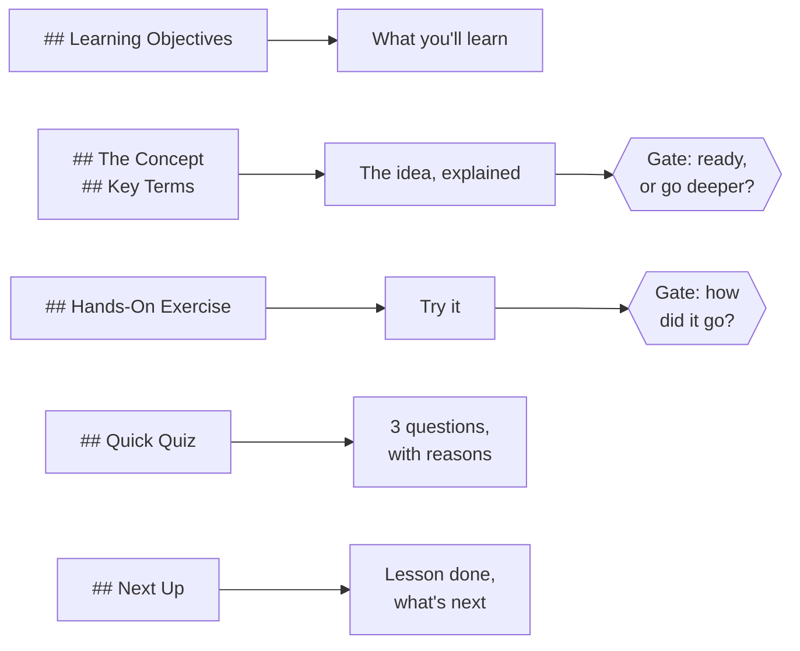
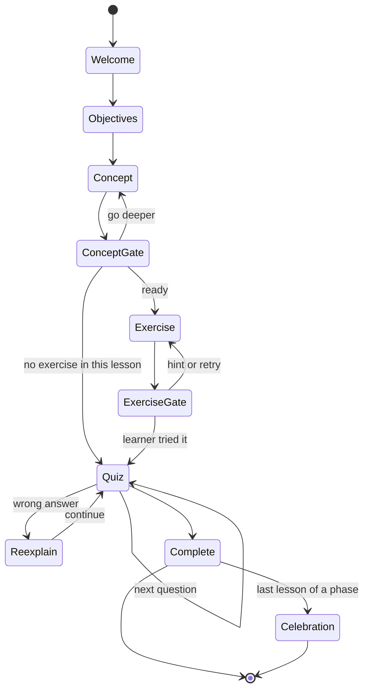
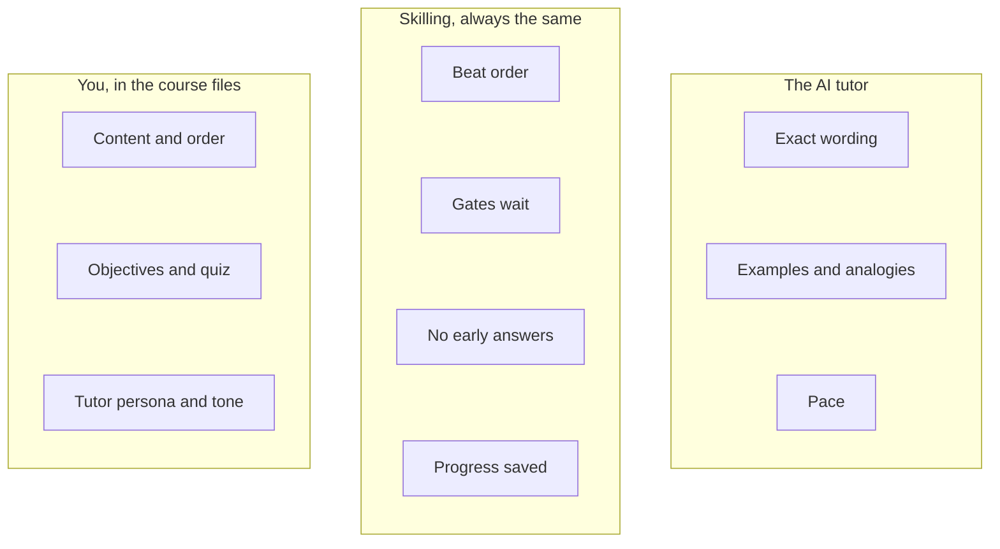

# How a course is taught

When a learner types `/learn`, the tutor doesn't just read your lesson out. It walks through
it in fixed steps, called **beats**, and waits for the learner at set points, called **gates**.
Knowing this helps you write lessons that teach well.

## Your sections become steps

The left column is what you write. The right is what the learner experiences. Every lesson
also opens with a short welcome.

## The full lesson loop

This is the exact order every tutor follows:

What this means for you as an author:

- **The concept gets taught more than once.** The tutor goes back to `## The Concept` when a
  learner asks to go deeper and when they get a quiz question wrong. Write it so it can be
  explained twice. See [writing lessons that teach](teaching-well).
- **Gates wait for a real reply.** The tutor never answers for the learner. Your exercise should
  give them something real to say.
- **Quiz feedback comes from your answer lines.** The tutor reads out your reason after every
  answer, so the reason matters as much as the right option.
- **The phase's last lesson is special.** It's where celebrations and homework happen.

## What you control, and what the tutor controls

Nobody can force an AI to teach well. What Skilling can do is make sure the machinery around it
is correct: the order, the waiting, the saving. That part is tested. The rest you guide with
your writing and with the `tutor` persona and tone in `course.yaml`.

## What gets saved about a learner

The tutor saves a small record in the learner's folder: finished lessons and dates, where they
are now, their streak and badges, and their homework. It never saves the conversation, and it
never stores counts like "lesson 3 of 9". Those are always worked out from your `course.yaml`,
so they can't go out of date.

This is why you should never write counts in your lessons either. See
[your first course](first-course#rules-worth-knowing-early).

## The honest trade-off

A fixed lesson shape doesn't suit everything. If your material needs five reading sections
and no quiz, it isn't a good Skilling course. The format trades some writing freedom for
courses that any tutor can teach the same way.

The precise rules are in the [runtime specification](/spec/runtime#the-delivery-loop).
