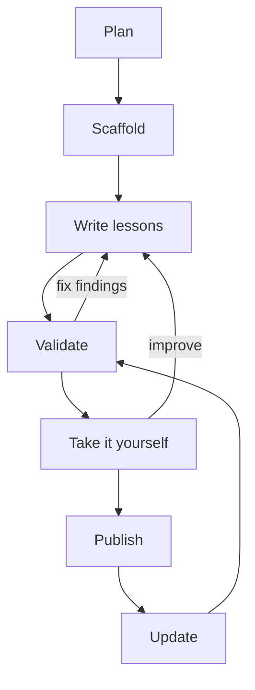

# Writing courses

A Skilling course is a folder of plain text files. You write the lessons. An AI tutor (Claude
Code or Codex) teaches them, one learner at a time, at each learner's pace.

You don't need to be a programmer. If you can write a clear explanation and a few quiz
questions, you can write a course.

## From idea to published course



| Step | Page |
|---|---|
| Understand the idea | [Why write a Skilling course](why.md), [how a course is taught](how-delivery-works.md) |
| Get set up | [Tools for authors](setup.md) |
| Write it | [Your first course](first-course.md), [anatomy of a lesson](lesson-anatomy.md), [writing lessons that teach](teaching-well.md) |
| Add the extras | [Objectives, quizzes and homework](objectives-quizzes-homework.md), [badges, celebrations and images](extras.md) |
| Check it | [Validate](validate.md), [take it as a learner](preview.md) |
| Share it | [Publish and share](publish.md), [updating a published course](updates.md) |
| The bigger picture | [The format and its status](status.md) |

## The short version

```bash
uv tool install skilling
skilling init my-course                       # make a starter course
skilling validate ./my-course --strict        # check it
skilling start ./my-course my-preview --json  # take it yourself
```

Then open `my-preview` in Claude Code or Codex and type `/learn` or `$learn`.
