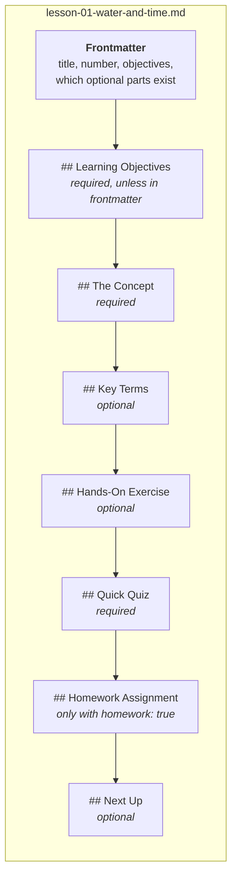
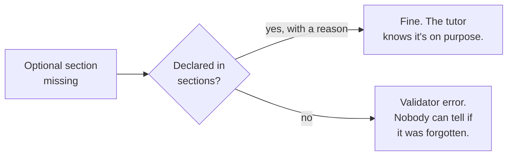

# Anatomy of a lesson

A lesson is one text file with two parts: a short header (called **frontmatter**) and a fixed
list of sections.



The headings must be spelled exactly like this and appear in this order. You can't add new
`##` sections, but you can use `###` subheadings inside any section.

**Why so strict?** The tutor teaching your course has never seen it before and can't ask you
what you meant. Because every lesson has the same shape, it always knows where the idea, the
exercise and the quiz are.

## The frontmatter

The frontmatter sits between two `---` lines at the top:

```yaml
---
title: Water and Time
phase: 1
lesson: 1
duration_minutes: 10
prerequisites: []
skills_unlocked: []
sections:
  key_terms: present
  exercise: present
  next_up: present
---
```

| Field | Meaning |
|---|---|
| `title`, `phase`, `lesson` | Must match `course.yaml`. The validator checks this, so a renumbered lesson can't go out wrong. |
| `duration_minutes` | Roughly how long the lesson takes. |
| `prerequisites` | Lessons that must come first, written as `"phase.lesson"`, like `["1.1"]`. |
| `skills_unlocked` | Badges the learner earns by finishing this lesson. |
| `objectives` | Optional. Named objectives the tutor can aim at. See [objectives](objectives-quizzes-homework#objectives). |
| `sections` | Says which optional sections this lesson has. |

## Each section's job

| Section | Its job | Tips |
|---|---|---|
| **Learning Objectives** | What the learner will be able to do by the end. | Write from the learner's side: "Explain why...", "Brew one cup...". |
| **The Concept** | Teach the idea. | One idea, a concrete example, enough to explain twice. |
| **Key Terms** | Define new words. | One line each. |
| **Hands-On Exercise** | Let the learner try it. | Give them a decision to make, not a page to copy. |
| **Quick Quiz** | Check understanding. | Exactly 3 questions, 4 options, an answer with a reason. |
| **Homework Assignment** | A task at the end of a phase. | A checklist the tutor can give feedback on. |
| **Next Up** | Tease the next lesson. | One or two sentences. No numbers. |

## Leaving a section out on purpose

Every optional section must be listed under `sections`. If you leave one out, say so and say
why:

```yaml
sections:
  key_terms:
    status: none
    intent: "No new words in this lesson; it applies the terms from lesson 1."
  exercise: present
  next_up:
    status: none
    intent: "Last lesson of the course, so there is nothing to tease."
```



The `intent` is shown to the learner in place of the missing part, so write it for them to read.

If a tutor finds no exercise and no reason, it might make one up, and then every learner gets a
different course. A short reason prevents that.

**On the last lesson of a course,** declare `next_up` absent. There's nothing to tease.

The full rules are in the [course format specification](/spec/course-format#lesson-files).
