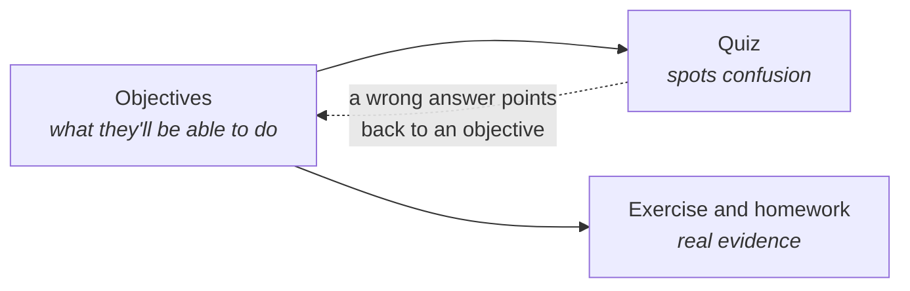
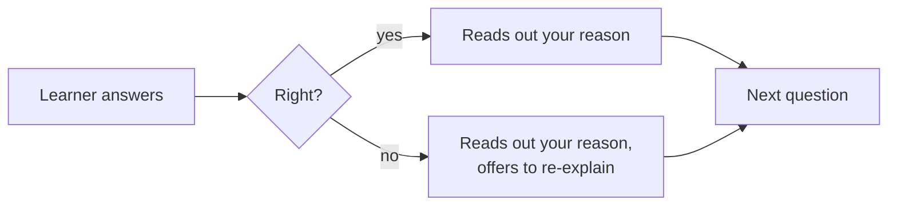

# Objectives, quizzes and homework

These three work together. Objectives say what the learner should be able to do. The quiz
checks for confusion along the way. Homework gives the learner something real to make.



## Objectives

You can write objectives as a simple list:

```markdown
## Learning Objectives
By the end of this lesson, you will:
- Explain why green tea needs cooler water than black tea
- Say what happens to tea when it steeps for too long
```

Or you can name them in the frontmatter, so the tutor can aim at each one:

```yaml
objectives:
  - id: explain-temperature
    kind: knowledge
    text: Explain why green tea needs cooler water than black tea
    about: [1, 2]
  - id: brew-and-record
    kind: practice
    text: Brew one cup on purpose and write down what you did and how it tasted
    verify: A brewing note exists in the learner's showcase folder with the tea, temperature, time and a taste note
```

Use one form or the other, not both. If you use the frontmatter form, leave out the
`## Learning Objectives` section.

### Two kinds of objective

| Kind | It means the learner... | How a tutor checks |
|---|---|---|
| `knowledge` | can **explain** something | By talking with them |
| `practice` | has **done** something, or their computer is in some state | By looking at files, Git or command output |

`practice` objectives are one reason Skilling uses coding assistants: they can actually look.

### The other fields

| Field | Use it to... |
|---|---|
| `about` | List the quiz questions (by number) that relate to this objective. The tutor can then say "that one was about water temperature" instead of repeating everything. |
| `verify` | Describe what success looks like, in one sentence, for a `practice` objective. |
| `check` | Optionally suggest a command that checks it, such as `node --version`. The tutor may decline, and never runs it without permission. |

Only use `verify` when a tutor can really see the result. An objective with no `verify` is
fine. It stays unconfirmed, which is more honest than a check that pretends.

## Quizzes

Every lesson has exactly **three questions**. Each has **four options**, `a)` to `d)`, and one
right answer. After the options comes an answer line with the right option **and the reason**:

```markdown
## Quick Quiz
1. Why does green tea often taste bitter with boiling water?
   - a) Boiling water removes the caffeine
   - b) Very hot water pulls out the bitter parts too quickly
   - c) Green tea leaves are always bitter
   - d) Boiling water makes the tea weaker

   **Answer:** b) Very hot water pulls out the bitter parts too quickly — green tea is
   delicate, so cooler water gives a softer taste.
```

The answer line must start with `**Answer:**`, then the option's letter, then its text, then
the reason. The tutor reads the reason out as feedback.



**A quiz is a checkpoint, not proof.** It never marks an objective as achieved by itself, and a
wrong answer never stops the learner finishing. Three multiple-choice questions can't prove
someone has learned something. They can show where they're confused, which is useful.

Long questions and options can wrap onto the next line. Indent the continuation to line up with
the text above it.

## Homework

Homework goes on the **last lesson of a phase**. The tutor hands it out at the phase boundary.

1. In `course.yaml`, add `homework: true` to that lesson.
2. In the lesson, add a `## Homework Assignment` section after the quiz:

```markdown
## Homework Assignment
### Brew and Record
**Objective:** Brew one cup of tea on purpose and keep a note you can use next time.

- [ ] A note naming the tea you used
- [ ] The water temperature and steeping time you chose, and why
- [ ] One sentence on how it tasted and what you'd change

**Stretch Goals:**
- [ ] Brew a second cup with one change and compare the two

**Submission:** Tell your tutor when your note is ready, and ask them to review it.
```

| Part | Meaning |
|---|---|
| `###` title | The assignment's name. |
| `**Objective:**` | One line on what it's for. |
| `- [ ]` items | The requirements. The tutor gives feedback on **each one** separately. |
| `**Stretch Goals:**` | Optional extras. Reviewed, but they never hold a learner back. |
| `**Submission:**` | How the learner hands it in. |

The tutor always reviews before submitting, and only submits when the learner clearly confirms.

Full details: [course format: section content](/spec/course-format#section-content).
