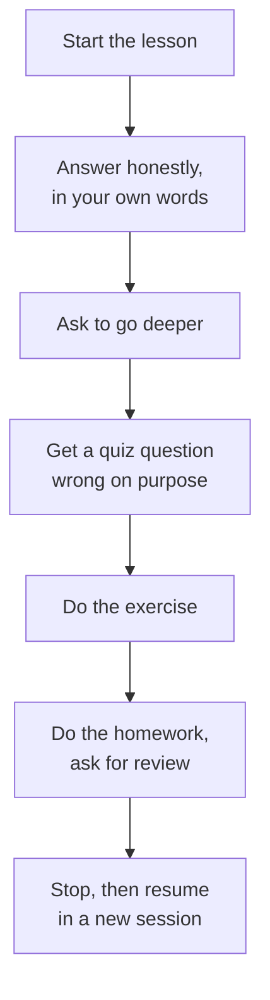

# Take it as a learner

The validator checks structure. Only taking the course shows you whether it **teaches**.

```bash
skilling start ./better-tea tea-preview --json
cd tea-preview
claude        # or: codex
```

Then type `/learn` (or `$learn`). Keep the preview folder separate from your course folder.

## Things to try



| Try | What to look for |
|---|---|
| Answer the first question honestly | Does the concept give the tutor enough to respond to you? |
| Ask "can you go deeper?" | Is there enough in `## The Concept` for a second explanation? |
| Get a quiz question wrong | Does your answer's reason explain the mistake? |
| Do the exercise | Can you do it with only what's in the lesson? Does the tutor do the typing? |
| Do the homework | Can the tutor give feedback on each checklist item? |
| Close and reopen, then `/learn` | Does it pick up in the right place? |
| Ask "how am I doing?" | Do the progress numbers look right? |

## Refresh the preview after editing

Run the same `start` command again. For a course in a folder on your computer, Skilling copies
the latest version of your files into the preview:

```bash
skilling start ./better-tea tea-preview --json
```

Before you **publish** a change, you do need to bump the version. See
[updating a published course](updates).

## Ask for a second opinion

Ask a friend who's new to the topic to take it. Ask them where they got stuck, not whether they
liked it.
