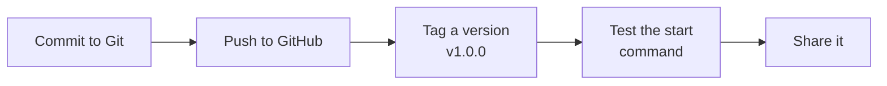

# Publish and share

Publishing a Skilling course means putting it in a Git repository and telling people one
command to start it.



## Step 1: put it in Git

If you haven't used Git before, your assistant can do this for you. Open your course folder in
Claude Code or Codex and ask: "Put this course in a new Git repository and push it to my
GitHub account." It will explain each step and ask before it runs anything.

Or run it yourself. A **commit** is a saved snapshot of your files:

```bash
cd better-tea
git init
git add .
git commit -m "First version of the tea course"
```

Then create an empty repository on [GitHub](https://github.com/new) and follow its "push an
existing repository" instructions. To **push** means to upload your commits.

A course can be the whole repository, or a folder inside it (for example `courses/better-tea`).

## Step 2: tag a version

A tag is a permanent label on one exact version of your files.

```bash
git tag v1.0.0
git push origin v1.0.0
```

Learners who use this tag always get exactly what you tested.

## Step 3: test the exact command

From a clean folder, run the command a stranger would:

```bash
skilling start 'gh:you/your-repo@v1.0.0#courses/better-tea' clean-test --json
```

Leave off `#courses/better-tea` if the course is at the top of the repository. Then open
`clean-test` in your assistant and check the first lesson starts.

:::warning
Don't share a branch name (like `main`) as if it were fixed. A branch is a line of work that
keeps changing; a tag never moves. Don't offer a ZIP download
either, because Skilling doesn't fetch those.
:::

## Step 4: write a README for learners

Your repository's `README.md` is the first thing learners see. Include:

- what the course teaches, and who it's for,
- what they need first,
- the tested start command,
- where to get help,
- a licence for your content.

Then add the badge:

```markdown
[](https://github.com/futureofdev/skilling)
```

You can also point learners to [start learning](../learn/start), which explains everything
from installing the tools onwards.

Next: [updating a published course](updates).
