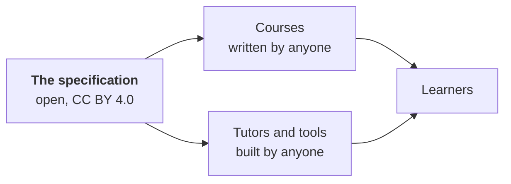

# The format and its status

Skilling is an **open format**: a public specification for what a course looks like, how a
tutor delivers it, and what's saved about a learner afterwards. Anyone can write courses in it
or build tools that teach it.

## How mature it is

It's young, and we'd rather say so plainly:

- **The specification is a draft.** It's versioned, and every change is recorded in the
  [changelog](/spec/CHANGELOG).
- **Conformance is self-certified.** "Conforming" means following the specification's rules.
  Tools check themselves against public checklists. There's
  no certification body.
- **Independent implementations: 0.** Everything so far was built by the same team. Until
  someone else builds a tutor or tool for the format, calling it a "standard" would be a claim,
  not a fact.

## What exists today

The `skilling` package is the reference implementation: the official example of a tool that
follows the specification, which others can compare against. It's free and open source (Apache-2.0)
and includes:

- the validator and the course loader,
- the lesson-order logic and the progress store,
- the learner commands (`start`, `courses`, `progress`, `upgrade` and more),
- the skills Claude Code and Codex use (`/learn`, `/progress`, `/homework`, `/upgrade-skilling`).

It has no AI model, agent framework or API key inside it. It even includes `skilling deliver`,
a plain-text tutor with no AI at all, which follows the same lesson rules.

For your own application, the optional `skilling-tutor` package connects a PydanticAI Agent
to course flow and saved progress. The [React example](../embed/quickstart.md) includes a
streaming interface and defaults to SQLite; file, PostgreSQL and S3 storage are also available.
These integrations are experimental source APIs. You provide model access and authentication;
follow [Embed a tutor](../embed/index.md) to get started.

The full list, with what each part claims and what it doesn't, is in the
[implementations registry](https://github.com/futureofdev/skilling/blob/main/docs/implementations.md).

## Get involved

- **Write a course** and tell us about it.
- **Report unclear spec wording.** If a rule can be read two ways, that's worth an
  [issue](https://github.com/futureofdev/skilling/issues).
- **Build a tutor or tool** for the format. A second implementation from someone new would help
  the project more than anything else. Start with the [specification](/spec) and the
  [implementation guide](https://github.com/futureofdev/skilling/blob/main/docs/implementing-a-runtime.md).
