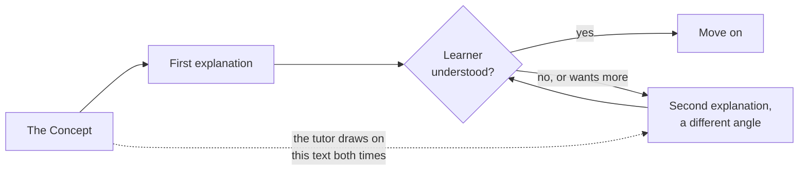

# Writing lessons that teach

The format makes sure a lesson is *taught correctly*. These tips help it be *taught well*.

## One idea per lesson

If a lesson has two big ideas, it's two lessons. Small lessons give learners more chances to
stop, answer and be checked. They also make progress feel real.

## Lead with a concrete example

Abstract explanations are hard to follow and hard to re-explain. Show the idea working:

> Picture two cups of the same green tea. One is made with boiling water and left for five
> minutes. The other uses slightly cooled water and comes out after two minutes...

Then name the idea. Example first, rule second.

## Write the concept to be taught twice

The tutor comes back to `## The Concept` when a learner asks to go deeper or gets a quiz
question wrong. If the concept is one thin paragraph, there's nothing left to say the second
time.



Give it substance: the idea, why it's true, a worked example, and a common mistake.

## Exercises for a tutor, not a text editor

The tutor can type commands and edit files for the learner. So build exercises around
**decisions**, not typing:

| Instead of... | Try... |
|---|---|
| "Copy this code into a file." | "Decide what the function should be called and why. Your tutor will create the file." |
| "Open a second terminal and run..." | "Predict what this command will print, then ask your tutor to run it." |
| "Write a summary." | "Tell your tutor the one thing that surprised you. It can save your words to your showcase folder." |

Keep learner-only steps for things the AI can't or mustn't do, such as typing a password or
approving something important.

Every exercise must work using only what's in the lesson. A learner who has to go and find
something else can get stuck in a way the tutor can't fix.

## Set the tutor's voice

The `tutor` block in `course.yaml` shapes how the tutor talks:

```yaml
tutor:
  persona: >
    A friendly tea enthusiast who explains one idea at a time,
    uses everyday examples, and checks in before moving on.
  tone:
    - Warm and plain, never fussy
    - Ask before changing pace or picking an example for the learner
```

It's guidance, not a script. Describe a person, not rules.

## Say what learners need first

If the course assumes something, such as a tool installed or an earlier course finished, say so
in the description and README. A tutor can't install a missing tool by pretending it's there.
Use `prerequisites` in the frontmatter for lessons that must come first.

## Write quiz questions that teach

- **Make wrong options tempting.** Use real misconceptions, not silly answers.
- **Explain the reason.** "b) — because..." is read out after every answer, even right ones.
- **Test the idea, not the wording.** Avoid questions answered by matching a phrase from the
  concept.

## Keep it honest

- **No counts in the text.** Skilling works them out.
- **Don't overpromise.** If a lesson only introduces an idea, say "introduce", not "master".
- **Use `verify` only where a tutor can really check.** See [objectives](objectives-quizzes-homework#objectives).

Next: [objectives, quizzes and homework](objectives-quizzes-homework).
