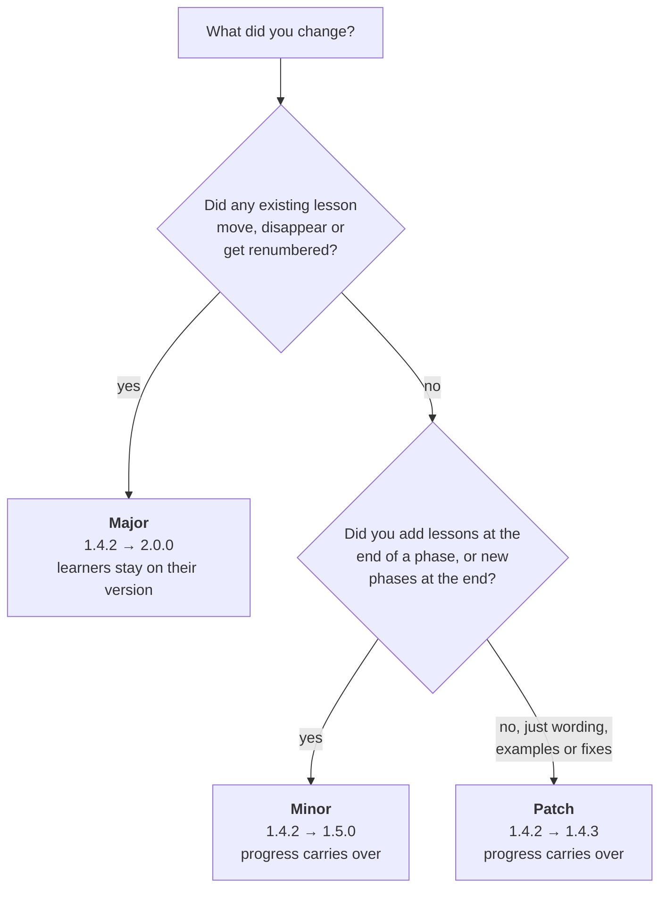

# Updating a published course

Learners save their progress against your lesson numbers. The version number tells Skilling
whether that progress can safely move to your new version.

## Bump the version for every change

Every published change needs a new `version` in `course.yaml`, even a typo fix. Skilling refuses
changed content that claims a version a learner already has.



| Change | Bump | Learners' progress |
|---|---|---|
| Wording, examples, corrections | Patch | Carries over |
| New lessons at the end of a phase, or new phases at the end | Minor | Carries over |
| Moving, removing or renumbering lessons or phases | Major | Learners stay on their current version |

## Let Skilling check your choice

Compare the old and new versions:

```bash
skilling diff ./better-tea-old ./better-tea --strict
```

It checks the lesson numbers mechanically and tells you if your version bump is too small.

## Publish the update

Tag the new version (`git tag v1.1.0` and `git push origin v1.1.0`) and update the start command
in your README. Learners move up by typing `/upgrade-skilling`, or running
`skilling upgrade --course better-tea`. Their tutor asks before changing anything.

**Never change the course `id`.** Learners' progress is saved under it.
