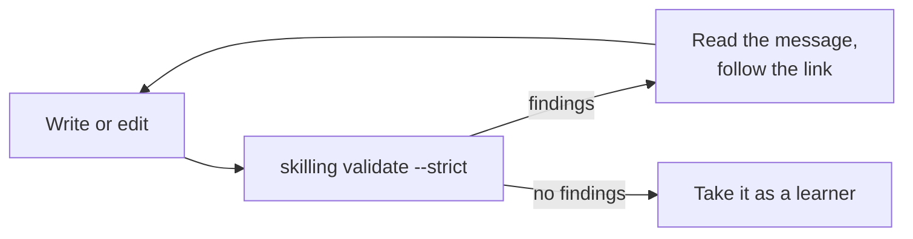

# Validate and fix findings

The validator reads your whole course and reports anything that breaks the rules: a missing
section, a quiz with the wrong number of options, a broken image link, a typo in a field name.

```bash
skilling validate ./better-tea --strict
```



## Reading a finding

Here's a real one, from a quiz question that only had three options:

```text
error   phases/phase-1-basics/lesson-01-water-and-time.md:50  quiz-wrong-option-count
       Question 1 has options ['a', 'b', 'c']; exactly four labelled a) to d) are required.
       → spec/course-format.md#quick-quiz

1 error, 0 warnings
```

| Part | Meaning |
|---|---|
| `error` | How serious it is. Errors and warnings both fail with `--strict`. When there are none, you'll see *conforming — no findings*, which means "follows all the rules". |
| `lesson-01-water-and-time.md:50` | The file and line number. |
| `quiz-wrong-option-count` | The error code. It never changes, so you can search for it. |
| The sentence | What's wrong, in plain words. |
| `→ spec/...` | The rule in the specification, if you want the detail. |

And one from a typo in `course.yaml`:

```text
error   course.yaml  manifest-invalid
       descripton: Extra inputs are not permitted
```

Unknown fields are always reported, so a typo can't go unnoticed.

Every code is explained in the
[error code catalogue](https://github.com/futureofdev/skilling/blob/main/docs/error-codes.md).

## Why always use `--strict`

Without `--strict`, warnings are reported but don't fail. But when a learner fetches your
course from Git, Skilling refuses any course with warnings or errors. So `--strict` is the
check that matches what learners will get.

## See the course the way Skilling does

```bash
skilling show ./better-tea
```

```text
Brew a Better Cup of Tea  (better-tea 1.0.0)
Learn why water temperature and steeping time change how tea tastes, and brew
one cup on purpose.

  Phase 1 — Tea Basics  basics
    · 1.1  Water and Time
    · 1.2  Your Perfect Cup homework

Derived (never authored)
  phases            1
  lessons           2
  phase 1 lessons    2
  badges            mindful-brewer
```

The "Derived" section shows the counts Skilling works out for you. You never write them.

## Check automatically on every change

If your course is on GitHub, add a workflow so every change is checked. Create
`.github/workflows/validate.yml`:

```yaml title=".github/workflows/validate.yml"
name: Validate course
on: [push, pull_request]
jobs:
  validate:
    runs-on: ubuntu-latest
    steps:
      - uses: actions/checkout@v7
      - uses: astral-sh/setup-uv@v9.0.0
      - run: uvx skilling validate . --strict
```

Error codes never change meaning, so it's safe to rely on them in automated checks.
