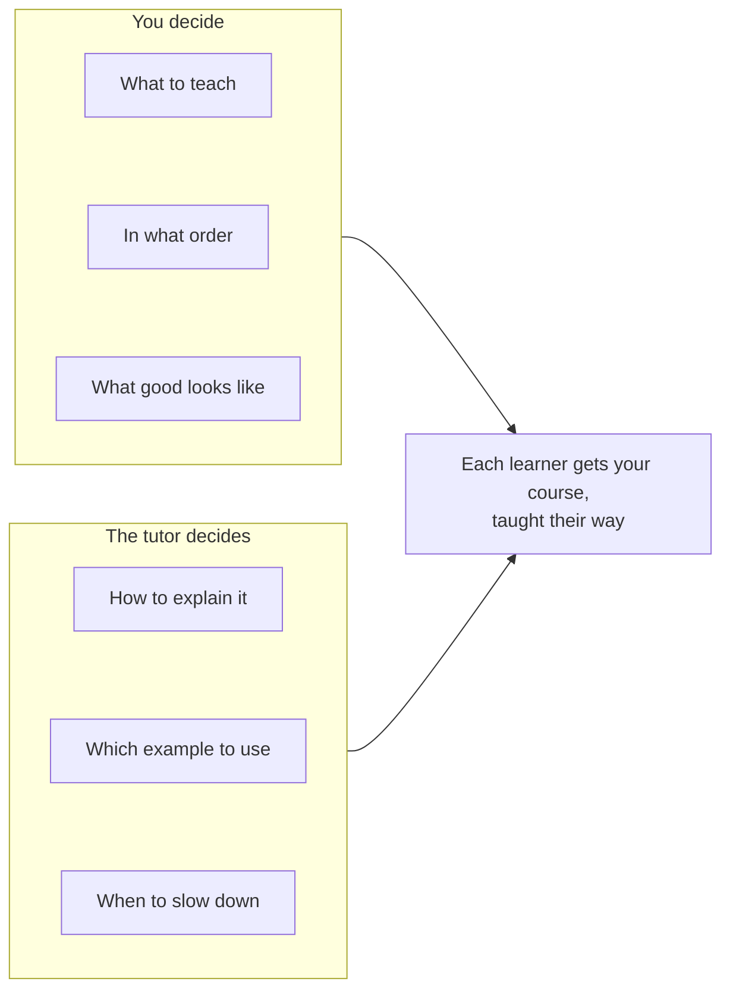

# Why write a Skilling course

Anyone can ask an AI to "teach me about tea". So why write a course at all?

## What a written course gives the tutor

An AI asked to teach on the spot has to invent the lesson plan as it goes. It doesn't know what
matters most, what order to go in, or what a learner should be able to do at the end. Every
learner gets a different course.

When you write the course, you decide those things. The AI does what it's good at: explaining,
listening, and adapting to each person.

## Why one-to-one matters

In 1984 Benjamin Bloom found that students with a personal tutor did far better than students
in a class. The average tutored student beat about 98% of the class. Later studies found
smaller gains, but the advantage is real. A personal tutor for
everyone used to be impossible. An AI tutor working from a good course gets much closer.

## What Skilling adds

- **Your course works with more than one tutor.** It's an open format. Claude Code and Codex
  both teach it today, and any tutor that follows the format can.
- **Learners keep their progress.** It's saved in their own folder, not in a company's
  database or a chat history.
- **The tutor can't skip the hard parts.** It has to wait for the learner's answers, can't
  reveal quiz answers early, and follows your lesson order.
- **Mistakes are caught before learners see them.** A validator checks every lesson's
  structure, every quiz and every link.
- **It's just files.** You write in plain text, keep it in Git, and publish it like any other
  project. No platform or sign-up.

## Is it the right fit?

**A good fit:**

- Step-by-step topics where each lesson builds on the last.
- Practical skills a learner can try on their own computer.
- Anything where explaining, checking understanding and re-explaining helps.

**Not a good fit:**

- Material that doesn't suit lessons with a concept, an exercise and a quiz. The lesson shape
  is fixed so any tutor can teach it.
- Formal exams. Skilling doesn't yet have assessed, graded delivery.
- Learners who don't have Claude Code or Codex, since a paid plan is needed today.

Next: [how a course is taught](how-delivery-works).
